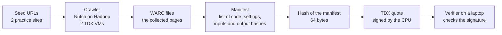
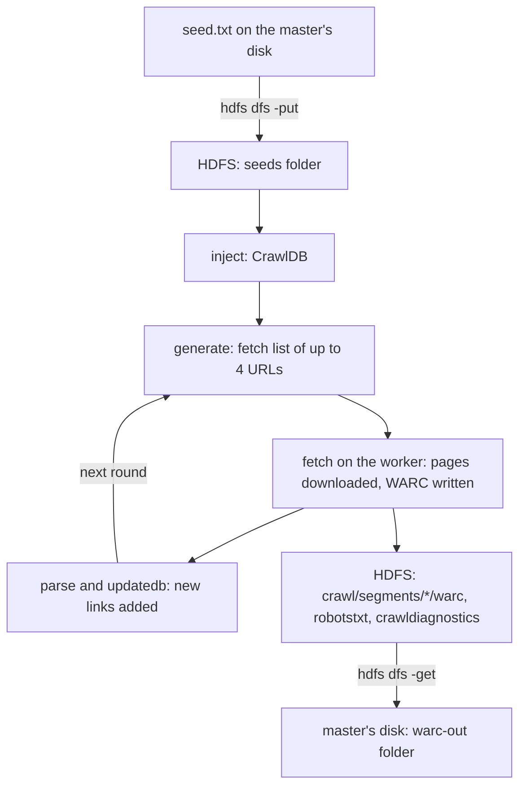
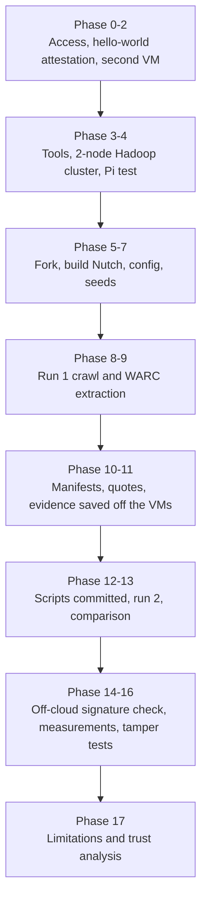
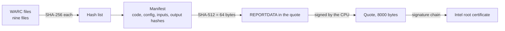

# From first principles: what we built, why, and how

A beginner's master guide to the experiment documented in this folder: running Common Crawl's crawler (CCBot,
a Nutch-based crawler) on a two-node Hadoop cluster inside Intel TDX Confidential VMs on Google Cloud, and
binding its output to hardware-signed statements called quotes.

The guide builds up in layers. Each layer explains the ideas it needs from scratch, then shows where we used them
and the real commands we ran. Every concept answers the same questions: **What is it? Why do we need it? How did we use it?**

> **Status: complete first version.** Layers 0 to 9 and the appendices are written. The other documents in this folder are the
> factual records (what was run, what was found); this guide is the explanation (what each idea is, why it was needed, how it was used).
> Read it in order: each layer uses only ideas from the layers before it.

## Plan of the guide

| Layer | Topic | Status |
|---|---|---|
| 0 | The problem: why trust in training data matters, and the big picture | written |
| 1 | Computers, virtual machines and the cloud (Google Cloud, accounts, SSH, networks) | written |
| 2 | The shell survival kit (bash, PowerShell, pipes, files, tmux) | written |
| 3 | Hashes, signatures and certificates | written |
| 4 | Confidential computing: TEEs, Intel TDX, attestation, quotes, measurements | written |
| 5 | Web crawling, Nutch, CCBot and the WARC format | written |
| 6 | Hadoop: HDFS, YARN, MapReduce, and how our two nodes work together | written |
| 7 | Building software: Java, Ant, Maven, Git, forks, branches, Conventional Commits | written |
| 8 | The whole experiment, step by step, from first login to the last commit | written |
| 9 | What the evidence proves and does not prove | written |
| Appendices | Glossary, command cheat sheet, troubleshooting | written |

## How to read each concept

Every concept below uses the same three questions:

- **What** it is, in plain words (with an analogy).
- **Why** the experiment needs it.
- **How** we used it, with the real command or setting.

Where a command appears, a short "what you should see" line follows, so you can tell whether it worked.

---

# Layer 0: The problem and the big picture

## 0.1 What is training data, and why does its origin matter?

Modern AI models learn from enormous collections of text, images and code called **training data**. A large share of
the text is collected from the public web by programs called **web crawlers**. **Common Crawl** is a non-profit that
runs a crawler (**CCBot**) and publishes the pages it collects, so that anyone can use them.

Here is the difficulty. When someone hands you a dataset, they also tell you where it came from and how it was cleaned.
You usually cannot check either statement. That matters because:

- **Poisoning.** Someone could insert pages that teach a model a hidden behaviour (a "backdoor").
- **False origin.** A dataset could be labelled "from the public web" when it is not.
- **Silent changes.** Data could be altered after collection, and nobody would notice.

## 0.2 The analogy: chain of custody

In a courtroom, evidence goes into a sealed bag. Every person who handles it signs a log, and the seal shows if anyone
opened it. A judge can trust the evidence **without trusting each person**, because the process is checkable.

The goal of this project is a digital version of that: a **chain of custody for data**, so that a third party can check
what happened to a piece of data without simply taking someone's word.

## 0.3 Three claims we would like to prove

| Claim | In plain words | Hard or easy? |
|---|---|---|
| **A. Origin** | "These bytes really came from that website at that time." | Hardest. Needs proof about the network, not just the computer |
| **B. Processing** | "This exact program, with these exact settings, produced this output." | Medium. This is where hardware attestation helps |
| **C. Integrity** | "Nothing changed after the output was produced." | Easy. Fingerprints (hashes) do this |

Our experiment mainly tests **B and C**. It also shows clearly why **A** needs extra tools (see
[limitations-and-trust.md](limitations-and-trust.md)).

## 0.4 Five words you will see everywhere

| Word | What it means here |
|---|---|
| **Provenance** | The recorded history of where something came from and what was done to it |
| **Attestation** | A statement about a computer or program that someone else can check |
| **Trust** | Relying on something without being able to check it yourself. We try to reduce what we must trust |
| **Verifier** | The person or program that checks an attestation |
| **TEE** (trusted execution environment) | A protected area of a computer whose memory even the machine's owner cannot read (explained fully in Layer 4) |

## 0.5 The big picture of what we built



In words:

1. We gave the crawler two starting web addresses (**seeds**).
2. The crawler, running on **two virtual machines** inside protected hardware, downloaded up to 10 pages and saved them
   as **WARC** files.
3. We wrote a **manifest**: a text list of the exact code versions, settings, inputs and output fingerprints.
4. We turned the manifest into a 64-byte fingerprint and asked the CPU to **sign a statement** (a quote) containing it.
5. On a different computer, with no Google account, we checked the quote's signature.

We did this twice, a day apart, and compared the results.

## 0.6 What the experiment shows, in one honest paragraph

It shows that a large, unmodified software stack (Hadoop, Java and a crawler) runs inside TDX protected virtual machines,
that the CPU can sign a statement tying our manifest to the machine, and that anyone can check that signature
independently. It does **not** show that the manifest is true, that the crawler code is the code we think it is, or that the
pages came from the real websites. Those gaps, and how to close them, are the subject of
[limitations-and-trust.md](limitations-and-trust.md).

## Check yourself (Layer 0)

1. Which of the three claims (A, B, C) is the hardest to prove, and why?
2. Why is "trust nobody, check everything" a better goal than "trust the data provider"?

---

# Layer 1: Computers, virtual machines and the cloud

## 1.1 A computer, from the bottom

| Part | What it is | Analogy |
|---|---|---|
| **CPU** | Does the calculations | The cook |
| **Memory (RAM)** | Fast, temporary workspace; wiped when the machine stops | The kitchen counter |
| **Disk** | Permanent storage | The pantry |
| **Operating system (OS)** | The main program that lets other programs use the parts | The kitchen manager |
| **Process** | A running program | One dish being cooked |

We used **Ubuntu 22.04**, a version of Linux, on all our machines.

## 1.2 Virtual machines and hypervisors

**What.** A **virtual machine (VM)** is a pretend computer running inside a real one. One physical server can host many
VMs. The software that creates and manages them is the **hypervisor**. The VM is the **guest**; the real server is the **host**.

**Why it matters to us.** In a normal cloud VM, the provider's hypervisor can see everything inside the guest, including its
memory. If you worry about the provider (or someone who breaks into it), that is a problem. Layer 4 explains how Intel TDX
protects the guest's memory from the host.

**Analogy.** An apartment building. The landlord (hypervisor) owns the building and holds a master key. A normal VM is an
ordinary apartment. A confidential VM is an apartment whose rooms the landlord cannot enter.

## 1.3 The cloud and Google Cloud Platform (GCP)

**What.** "The cloud" means renting computers from a company over the internet. **Google Cloud Platform (GCP)** is
Google's service for that.

**Key words:**

| Term | Meaning | Our value |
|---|---|---|
| **Project** | A container for your cloud resources and permissions | `training-custody` |
| **Project ID** | The unique name used in commands | `training-custody` |
| **Region / zone** | Where the machines physically are. A zone is one data centre area inside a region | zone `us-central1-a` |
| **Machine type** | How big the VM is | `c3-standard-4`: 4 virtual CPUs, 16 GB memory |
| **Instance** | One VM | `tdx-lab` (master), `tdx-lab-worker` (worker) |
| **Image** | The starting disk contents (the OS) | Ubuntu 22.04 |

**Why we need a project.** Everything in GCP belongs to a project, and permissions are granted per project. You must be a
member with the right permissions before you can see or use the machines.

## 1.4 Accounts and permissions (IAM)

**What.** **IAM** (Identity and Access Management) decides who can do what. A **role** is a bundle of permissions
(for example "can view VMs" or "can create VMs"). Your Google account is given roles on a project by its owner.

**Why.** Seeing a project is not the same as being allowed to log in to a VM or create one. We found this out step by step:
we first checked that we could *see* the project, then the VMs, then that we could *log in*.

## 1.5 The tools: `gcloud` and Cloud Shell

- **`gcloud`** is Google's command-line tool for managing cloud resources.
- **Cloud Shell** is a small temporary Linux machine you open in your web browser. `gcloud` is already installed there and
  you are already signed in. Its home folder keeps your files between sessions; everything else is reset.

**Why Cloud Shell.** Nothing to install, and it sits in Google's network. We used it as the **control room** for every login.

### Commands we ran first (in Cloud Shell)

```bash
gcloud auth list
```
Shows which Google account is signed in (a `*` marks the active one). **Check it is the account your project owner invited.**

```bash
gcloud projects list
gcloud projects describe training-custody
```
The first lists projects you can see. The second shows details; we looked for `lifecycleState: ACTIVE`.

```bash
gcloud config set project training-custody
gcloud config list
```
Sets the default project, so later commands do not need `--project`. `config list` shows what is set.

```bash
gcloud compute instances list
```
Lists the VMs. We saw `tdx-lab` in `us-central1-a`, type `c3-standard-4`, status `RUNNING`.

```bash
gcloud compute instances describe tdx-lab --zone=us-central1-a \
  --format="yaml(name,status,machineType,confidentialInstanceConfig,scheduling)"
```
Prints chosen settings of one VM. We looked for two lines: `confidentialInstanceType: TDX` (it is a TDX confidential VM)
and `onHostMaintenance: TERMINATE` (explained in 1.8).

**A note on `gcloud auth login`.** In Cloud Shell it warns that you are already signed in. That is normal, and the right answer is `n`.

## 1.6 SSH: logging in to a remote machine

**What.** **SSH** (secure shell) gives you a text window onto another computer, over an encrypted connection.

**How the login is secured.** SSH uses a **key pair**:

- a **private key** that stays secret on your side (like a house key you never lend out), and
- a **public key** that you give to the machine (like a lock that only your key opens).

When you first run `gcloud compute ssh`, it creates the key pair for you, stores the private key in `~/.ssh/google_compute_engine`,
and uploads the public key to the project's settings. It asks for an optional **passphrase**, a password protecting the private key.

```bash
gcloud compute ssh tdx-lab --zone=us-central1-a
```
Logs in to the master VM. **Wait for the new prompt** before typing anything else.

**Why not log in from one VM to the other?** We tried once by mistake. It fails with "insufficient authentication scopes",
because a VM is not allowed to manage other VMs by default. So every login goes **through Cloud Shell**.

### Where am I? (the most useful habit)

The text before the `$` tells you which machine you are typing into:

| Prompt looks like | You are on | Confirm with |
|---|---|---|
| `rishabsdp17@cloudshell:~ (training-custody)$` | Cloud Shell | |
| `rishabsdp17@tdx-lab:~$` | the **master** VM | `hostname` prints `tdx-lab` |
| `rishabsdp17@tdx-lab-worker:~$` | the **worker** VM | `hostname` prints `tdx-lab-worker` |
| `PS C:\Users\...>` | your Windows laptop (PowerShell) | |

Moving between them:

| From | To | Commands |
|---|---|---|
| VM | Cloud Shell | `exit` |
| Cloud Shell | master | `gcloud compute ssh tdx-lab --zone=us-central1-a` |
| Cloud Shell | worker | `gcloud compute ssh tdx-lab-worker --zone=us-central1-a` |

## 1.7 Networks, IP addresses and firewalls

| Term | What it is | Our values |
|---|---|---|
| **IP address** | A machine's address on a network | master `10.128.0.2`, worker `10.128.0.5` (internal) |
| **Internal vs external IP** | Internal works inside the private network; external is reachable from the internet | We used only internal addresses between the VMs |
| **VPC network** | Your private network in the cloud | the `default` network |
| **Firewall rule** | A rule that allows or blocks traffic on certain ports | `default-allow-internal`, `default-allow-ssh`, others |
| **Port** | A numbered door on a machine for one kind of traffic | SSH uses 22; Hadoop uses several |
| **Hostname / alias** | A name for a machine | we added `hadoop-master` and `hadoop-worker` in `/etc/hosts` |

**Why this matters.** The rule `default-allow-internal` lets our two VMs talk on **all ports**, which is why Hadoop worked
without us adding rules. It also means traffic between the nodes is not hidden from the network (a weakness discussed in the
limitations report). We never opened Hadoop to the internet.

We checked that the two VMs could reach each other with `ping` (it sends small test messages):
```bash
ping -c 3 10.128.0.2
```
`-c 3` means "three messages". We wanted 3 replies and 0% loss.

## 1.8 Why the VMs can be stopped: live migration

Normally a cloud provider moves a running VM to another server before maintenance, without stopping it (**live migration**).
TDX VMs cannot do this, because their memory is encrypted with a key tied to one physical CPU. Google therefore **stops** the VM
for maintenance. That is the setting `onHostMaintenance: TERMINATE`. Consequence: **never keep important results only on a
VM's disk**. We copied evidence to Cloud Shell and to a laptop.

## 1.9 Creating the worker VM

The master existed already. We created the worker with the same protection:

```bash
gcloud compute instances create tdx-lab-worker \
  --machine-type=c3-standard-4 --zone=us-central1-a \
  --confidential-compute-type=TDX --maintenance-policy=TERMINATE \
  --image-family=ubuntu-2204-lts --image-project=ubuntu-os-cloud
```
(Only the tail of the real command was captured, so this is the intended form.) Creating VMs needs a stronger permission than
logging in, and costs money, so we asked the mentor first.

## Check yourself (Layer 1)

1. What is the difference between a project ID and a project name?
2. Why do we log in to the worker from Cloud Shell and not from the master?
3. What happens to a TDX VM during host maintenance, and what should you do about it?

---

# Layer 2: The shell survival kit

The **shell** is the text program you type commands into. On the VMs and in Cloud Shell it is **bash**. On your Windows laptop
it is **PowerShell**. They look alike but differ in important details (see 2.8).

## 2.1 Files and folders

| Command | What it does | Example from our work |
|---|---|---|
| `pwd` | Prints the folder you are in | `/home/rishabsdp17/ccbot-work/nutch-cc` |
| `cd folder` | Moves into a folder | `cd ~/ccbot-work` |
| `ls` / `ls -l` | Lists files / with details (size, date) | `ls -l attest-out/` |
| `mkdir -p path` | Creates a folder (and parents) | `mkdir -p ~/ccbot-work/warc-out/pages` |
| `cat file` | Prints a file | `cat manifest-master.txt` |
| `rm file` | Deletes a file | we deleted only files we had made |

`~` means "your home folder". A path starting with `/` starts from the very top of the machine.

## 2.2 Running things as the administrator

`sudo` runs one command with administrator rights. We needed it to install software (`sudo apt install ...`) and to ask the
kernel for an attestation quote. **Be careful:** `sudo` can change or delete anything.

## 2.3 Pipes and redirection: connecting commands

| Symbol | What it does | Example |
|---|---|---|
| `\|` (pipe) | Sends one command's output into the next command | `zcat file.gz \| grep -c response` |
| `>` | Writes output into a file (replaces it) | `echo hello > output.txt` |
| `>>` | Adds output to the end of a file | `echo ... >> ~/.bashrc` |
| `2>&1` | Sends error messages to the same place as normal output | used with `tee` |
| `tee file` | Shows output **and** saves a copy | `... \| tee crawl-run2.log` |

**Analogy.** Pipes are a conveyor belt of text between workstations.

## 2.3b Variables, command substitution and heredocs

- A **variable** stores text: `Q=evidence/master/attest-out/quote-master.bin`, then `$Q` uses it.
- `$(command)` runs a command and inserts its output: `echo "node: $(hostname)"`.
- A **heredoc** writes several lines into a file. We used it to create the Hadoop settings files:

```bash
cat > file.xml <<EOF
...text with $HOME expanded...
EOF
cat > file.sh <<'EOF'
...text exactly as typed, nothing expanded...
EOF
```
Quotes around `EOF` (`'EOF'`) turn **off** expansion. We used the unquoted form when we wanted `$HOME` filled in with the real
path, and the quoted form when we wanted literal `$HOME` text.

## 2.4 Searching and cutting text

| Command | What it does | Example |
|---|---|---|
| `grep pattern` | Shows lines containing a pattern | `grep -i tdx` (case-insensitive) |
| `grep -c` | Counts matching lines | counting `WARC-Type: response` |
| `grep -a` | Treats binary-looking text as text | needed for WARC files |
| `sed -i 's/old/new/' file` | Replaces text in a file | our tamper test changed `crawl` to `Crawl` |
| `awk` | A tiny language for columns and rules | listing the URLs of `response` records |
| `cut -d' ' -f1` | Takes one column | the hash from `sha256sum` output |
| `tr -d '\r'` | Deletes characters | removing carriage returns |
| `sort`, `uniq -c` | Sorts; counts repeats | counting record types |
| `head`, `tail` | First / last lines | `tail -5 build.log` |

## 2.5 Hashes and reading bytes

| Command | What it does |
|---|---|
| `sha256sum file`, `sha512sum file` | Prints a fingerprint of a file (see Layer 3) |
| `sha256sum -c list.txt` | Re-checks files against a saved list; prints `OK` or `FAILED` |
| `xxd` or `od` | Shows raw bytes. `od -An -v -tx1 -j OFFSET -N LENGTH file` reads LENGTH bytes starting at OFFSET as hex |
| `cmp -l a b` | Lists bytes that differ between two files |
| `zcat file.gz` | Prints a compressed file without unpacking it |

We used `xxd` on the VMs, but Cloud Shell does not have it, so we used `od` there.

## 2.6 Downloading, copying and archiving

| Command | What it does |
|---|---|
| `wget URL` | Downloads a file |
| `tar -xzf file.tar.gz` / `tar -czf out.tar.gz folder` | Unpacks / packs an archive |
| `gcloud compute scp VM:path localpath` | Copies a file between a VM and Cloud Shell |
| `curl -s URL` | Fetches a web page (we used it to read `robots.txt`) |

## 2.7 Keeping long jobs alive: tmux

**What.** `tmux` is a "terminal inside a terminal" that **keeps running if your connection drops**.

**Why.** Our builds and crawls took 6 to 11 minutes. A dropped connection, or a laptop crash (it happened), would normally kill
the command.

| Action | Keys or command |
|---|---|
| Start a session named `crawl2` | `tmux new -s crawl2` |
| **Detach** (leave it running) | press **Ctrl+B**, let go, then press **D** |
| Come back | `tmux attach -t crawl2` |
| List sessions | `tmux ls` |
| End the session | type `exit` once |

**Two traps we met:**
- Detaching is **Ctrl+B then D**, not Ctrl+P (which switched our browser tab).
- Paste `tmux new` **alone** and wait for the prompt. Lines pasted straight after it are lost.

**Another trap: `| tail -30`.** It prints nothing until the command ends, so the screen looks frozen. Use
`| tee file.log | tail -30` so there is a log file to inspect.

## 2.8 PowerShell on Windows: the differences that bit us

| Task | bash (VMs, Cloud Shell) | PowerShell (laptop) |
|---|---|---|
| Continue a command on the next line | end the line with `\` | end the line with a backtick, or just use one line |
| Home folder | `~` or `$HOME` | `$HOME` |
| Run a program given as a quoted path | `"/path/prog" args` | `& "C:\path\prog.exe" args` |
| Hash a file | `sha256sum file` | `Get-FileHash file -Algorithm SHA256` |
| Folder separator | `/` | `\` (Git accepts `/` too) |

Our commit with `\` line breaks failed in PowerShell for exactly this reason.

## 2.9 Three habits that prevent most mistakes

1. **Run `hostname` before important commands**, so you know which machine you are on.
2. **Paste one command at a time**, and wait for the prompt after any login or `tmux new`.
3. **Let the computer compare things** (for example `[ "$a" = "$b" ] && echo SAME`). Comparing long hashes by eye, or retyping
   them, caused wrong results in this work.

## Check yourself (Layer 2)

1. What does `zcat pages/*.warc.gz | grep -a -c '^WARC-Type: response'` do, piece by piece?
2. Why does the heredoc use `<<'EOF'` in one place and `<<EOF` in another?
3. A command seems frozen. What two things should you check before assuming it is stuck?

---

# Layer 3: Hashes, signatures and certificates

Everything the Intel hardware does for us rests on three ideas from cryptography: **hashes** (fingerprints), **signatures**
(unforgeable approval) and **certificates** (a chain of "I vouch for this key"). You do not need any mathematics. You only need
to know what each one promises and what it does not.

## 3.1 Hashes: a fingerprint for data

**What.** A **hash function** reads any amount of data (one letter or a whole movie) and produces a short, fixed-size
**fingerprint** called a **hash** or **digest**.

A good hash function has four properties:

| Property | Meaning | Why it matters to us |
|---|---|---|
| **Deterministic** | The same data always gives the same fingerprint | Anyone can recompute it and compare |
| **Fixed size** | The output length never changes | A 10 GB file and a 5-byte file both give, say, 32 bytes |
| **Avalanche** | Change one tiny thing and the fingerprint changes completely | Tampering is obvious |
| **One-way** | You cannot rebuild the data from its fingerprint | A hash reveals nothing about the content |

**Analogy.** A fingerprint identifies a person but you cannot recreate the person from it. A tamper-evident seal on an evidence
bag: break it, and everybody can see.

**A real example you can run.** We changed one letter and compared the SHA-256 fingerprints:

```bash
printf 'hello\n' | sha256sum
# 5891b5b522d5df086d0ff0b110fbd9d21bb4fc7163af34d08286a2e846f6be03

printf 'hellp\n' | sha256sum
# bf8c83416f31143ee2fa5db7ebbbb54589626c4c2046a91d28545bc403e3cda6
```
One letter apart, and the two fingerprints share nothing. That is the **avalanche** property.

**Hashes are not encryption.** Encryption hides data and can be reversed with a key. A hash cannot be reversed. We use hashes to
**check**, not to hide.

## 3.2 The hash family we met

| Name | Size in bytes | Size in hex characters | Where it appeared |
|---|---|---|---|
| SHA-1 | 20 | 40 | Inside WARC records (`WARC-Payload-Digest: sha1:...`), written by the crawler. SHA-1 is an older design that is no longer considered strong |
| SHA-256 | 32 | 64 | Our file fingerprints (`sha256sum`), manifests of config and outputs |
| SHA-384 | 48 | 96 | TDX measurement values (MRTD, RTMRs) are 48 bytes |
| SHA-512 | 64 | 128 | The value we place in a quote's REPORTDATA field |

## 3.3 Bytes and hex: reading the numbers

A **byte** is the smallest chunk of data most computers handle (a number from 0 to 255). We usually print bytes in **hexadecimal**
("hex"), where each byte is **two characters** from `0-9` and `a-f`. The byte 255 is `ff`.

So a SHA-512 fingerprint is 64 bytes, and 64 bytes shown as hex is **128 characters**. That is why we can say "REPORTDATA is exactly
64 bytes" and "the hash is 128 hex characters" about the same thing.

**Offset.** The position of a byte inside a file, counting from 0. "Bytes 568 to 631 of the quote" means a 64-byte window that starts
568 bytes from the beginning.

**Converting hex text into raw bytes.** `xxd -r -p` does it. We used it to turn the 128-character text of a SHA-512 hash into the
64 raw bytes the CPU expects:

```bash
sha512sum output.txt | cut -d' ' -f1 | xxd -r -p > reportdata.bin
ls -l reportdata.bin     # must be exactly 64 bytes
```
Piece by piece: `sha512sum` prints `HASH  filename`; `cut -d' ' -f1` keeps only the hash; `xxd -r -p` converts hex text to bytes; `>` saves them.

## 3.4 The seed-file story: why we compare hashes, not sizes

Our seed file holds two web addresses. It looks trivial, yet three slightly different versions existed. All three are real:

| Version | Line endings | Size | SHA-256 starts with |
|---|---|---|---|
| Created on the VM (the one run 1 used) | LF after both lines | **57 bytes** | `14a80f8c8eaa` |
| Saved by Windows | CRLF between lines, no final newline | **57 bytes** | `2b87a8c8187d` |
| What Git first stored | LF, no final newline | **56 bytes** | `1d53fc27954e` |

- **LF** (`\n`, "line feed") is the line break Linux uses. **CRLF** (`\r\n`, "carriage return + line feed") is the Windows one.
- Two of the versions have the **same size** (57) but **different** fingerprints. A size check would have said "identical".
- Run 2 had to use the exact run-1 bytes so the comparison was fair, so we rewrote the file byte for byte and checked the hash.

**Lesson.** Compare hashes, never sizes or eyeballed text. And let the computer do the comparing:

```bash
[ "$a" = "$b" ] && echo SAME || echo DIFFERENT
```

## 3.5 Where we used hashes in the experiment

| Use | What we hashed | Why |
|---|---|---|
| Download check | The Hadoop tarball (SHA-512 against Apache's published value) | Be sure the file was not corrupted or swapped |
| Evidence fingerprints | Each WARC file (`SHA256SUMS.txt`) | Detect later changes (`sha256sum -c` prints `OK`) |
| Input fingerprints | `nutch-site.xml`, seed file, the crawler `.job` file, Hadoop config files | Prove run 2 used identical inputs |
| The manifest | The whole manifest text, with SHA-512 | Produces the 64 bytes placed inside the quote |
| Tamper tests | Original vs. altered copy | Show that one changed byte is detectable |

## 3.6 Digital signatures: unforgeable approval

**What.** A **digital signature** shows that the holder of a **private key** approved an exact piece of data.

- A **key pair** has two halves. The **private key** is kept secret. The **public key** is shared with everyone.
- To **sign**, you combine the data with your private key. The result is the signature.
- To **verify**, anyone uses the public key to check that the signature matches the data. They never see the private key.

**Analogy.** A wax seal made by a unique stamp. Everybody knows what the stamp's imprint looks like (the public key), but only
one person owns the stamp (the private key). A letter whose seal matches the known imprint came from that person, and if anyone
changes the letter after sealing, the seal no longer fits.

**Properties we rely on:**
- If **any byte** of the signed data changes, verification fails. (We proved this: flipping one bit in a quote broke its signature.)
- A signature proves **who approved**, not that the content is **true**.

The signature scheme used for TDX quotes is **ECDSA** (a standard type based on elliptic curves). The key that signs a quote is called
the **attestation key**.

## 3.7 Certificates and chains of trust

**The problem.** A signature only helps if you know the public key really belongs to the claimed signer. How do you know?

**What a certificate is.** A **certificate** is a signed statement: "this public key belongs to this identity", signed by someone
you trust more. Certificates form a **chain**:

```
Root certificate  (you already trust it)
   └─ signs → Intermediate certificate
                 └─ signs → Leaf certificate  (the one used to sign your data)
```

To verify, you start at the leaf and follow the signatures upward until you reach a **root** you already trust. The root is the
**trust anchor**: you must obtain it by some other safe route.

**Analogy.** A passport. Your passport is trusted because a passport office issued it; that office is trusted because the
government authorised it; and you already trust the government. You walk up the chain until you reach something you trust
without further proof.

**Revocation.** If a certificate is stolen or found faulty, its issuer can publish a **certificate revocation list (CRL)**: a list of
certificates that must no longer be trusted. A thorough verifier downloads it.

**What this meant for us.** The signature on a TDX quote chains up to an **Intel root certificate**. When we verified the quotes:

- the **basic** check used a copy of the Intel root certificate that is **built into the tool** (it printed a warning saying so);
- the **strict** check (`-get_collateral=true -check_crl=true`) also downloaded Intel's certificate data and revocation lists.

Both passed. The honest caveat: with the basic check, trust in the root rests on the tool you downloaded.

## 3.8 TLS, HTTPS and why they do not solve "origin"

**TLS** is the encryption layer behind `https://`. When your browser (or our crawler) connects to a website:

1. The server presents a **certificate** chain; the client checks it and learns it is talking to the real `example.com`.
2. Both sides agree on temporary keys and encrypt the conversation.

TLS protects the **connection**. But it does **not** give the client a signed copy of what the server said. So the crawler can
say "I got these bytes from that server", yet it cannot **prove** that to a third party. This is why claim A in Layer 0 ("these
bytes really came from that website") is the hardest, and why research ideas such as "TLS oracles" exist. Our experiment did not
try to solve it; the limitations report (row 18) explains the options.

## Check yourself (Layer 3)

1. Two files are both 57 bytes. Are they identical? How would you find out?
2. Why is a 64-byte value the right size to carry a SHA-512 hash?
3. What is a trust anchor, and why must it come from somewhere other than the thing being checked?
4. TLS proves who you are talking to. What does it not prove?

---


# Layer 4: Confidential computing, Intel TDX and attestation

This is the heart of the experiment. We first ask who can see your data, then how a special CPU hides it, then how that CPU can
**prove** something about a machine to a stranger.

## 4.1 Who can see your data? Three states

Data lives in three states:

| State | Example | Usual protection |
|---|---|---|
| **At rest** | Files on a disk | Disk encryption |
| **In transit** | Data crossing a network | TLS / VPN |
| **In use** | Data in memory while a program works on it | Usually **none** |

The third state is the gap. In a normal cloud VM, the cloud's own software (the hypervisor) and its administrators could in
principle read the VM's memory. **Confidential computing** closes that gap.

## 4.2 Trusted execution environments (TEEs)

**What.** A **trusted execution environment (TEE)** is a protected area of a computer. The CPU **encrypts its memory** and
refuses to let anything outside (including the operating system or hypervisor below it) read or change the contents.

**Why.** If the machine's owner is not the data owner, you want the work to be private and unmodifiable by the owner.

**Two styles:**

| Style | Protects | Examples | Trade-off |
|---|---|---|---|
| **Process-level** | One small program (an "enclave") | Intel SGX, AWS Nitro Enclaves | Small trusted base, but you must adapt your software; limited memory |
| **VM-level** | A whole virtual machine | **Intel TDX**, AMD SEV-SNP | Runs unmodified software, but the trusted base is large (a whole OS) |

We chose **VM-level** because Hadoop and a crawler are big Java programs that we did not want to rewrite.

**TCB (trusted computing base).** Everything you must trust for the protection to hold. For us that is the CPU, Intel's TDX
software, Google's virtual firmware, **and** the whole Ubuntu system, Java, Hadoop and the crawler inside the VM. A large TCB means
more places for a bug to hide.

## 4.3 Intel TDX

**What.** **Intel TDX (Trust Domain Extensions)** is Intel's VM-level TEE.

| Term | Meaning |
|---|---|
| **Trust Domain (TD)** | A TDX-protected virtual machine (our `tdx-lab` and `tdx-lab-worker`) |
| **TDX module** | Intel-supplied software that runs in a special CPU mode and manages TDs |
| **Private memory** | Guest memory encrypted with a key held by the CPU; the host cannot read it |
| **Shared memory** | A small area the guest deliberately shares with the host, for example for network and disk traffic |
| **Confidential VM (CVM)** | Google's name for such a protected VM |

**What TDX protects:** the *contents* of the guest's private memory from the host and hypervisor.

**What TDX does not protect (important):**

- **Availability.** The host can still stop the VM or deny it resources.
- **Network and disk.** Data leaving the VM travels through shared memory and the host's devices.
- **The clock.** Time is supplied by the host.
- **The software inside.** A bug in Java, Hadoop or our scripts is still a bug.
- **Side channels.** Indirect leaks (timing, memory-access patterns) are outside Intel's stated protection.

The full list, with sources, is in [limitations-and-trust.md](limitations-and-trust.md).

### How we confirmed we were really inside a TD

```bash
sudo dmesg | grep -i tdx
```
`dmesg` prints the kernel's start-up messages and `grep -i tdx` keeps lines mentioning "tdx". We looked for:

- `tdx: Guest detected`
- `Memory Encryption Features active: Intel TDX`

```bash
ls /sys/kernel/config/tsm/
```
We expected a folder named `report` (the interface for requesting a quote, see 4.7).

On Google's side, `gcloud compute instances describe` showed `confidentialInstanceType: TDX`.

## 4.4 Why a TDX VM cannot live-migrate

Normal VMs can be moved between servers while running. A TD's memory is encrypted with a key tied to one physical CPU, so it
cannot be moved. Google therefore **terminates** the VM for host maintenance (`onHostMaintenance: TERMINATE`). Plan for restarts,
and never keep results only on the VM (see Layer 1).

## 4.5 Attestation: proving something to a stranger

**What.** **Remote attestation** lets a machine give a verifier **evidence** about itself that the verifier can check.

**Why.** Memory encryption is useless to an outsider unless they can confirm it is switched on and see what is running inside.

**The idea in four steps:**

1. **Measure.** As the machine starts, each stage of software is hashed into a **measurement register**.
2. **Report.** A TD asks the CPU for a **report** containing those measurements plus 64 bytes of its own choosing.
3. **Sign.** The report is turned into a **quote**: a statement **signed** with a key whose certificate chain leads to Intel.
4. **Verify.** The verifier checks the signature chain, then reads the measurements.

**Analogy.** A notarised photograph. A notary (the CPU) stamps a photo (the measurements) and records the date. A stranger who
trusts the notary's authority can believe the photo is genuine, without ever visiting the scene.

## 4.6 Inside a quote

A quote is a binary file, **8000 bytes** in our case. Its layout (as we established from our own files, consistent with Intel's
published format; see [quote-verification.md](quote-verification.md)) is:

| Field | Offset (byte position) | Length | What it is |
|---|---|---|---|
| Header | 0 | 48 | Version, key type, TEE type |
| TEE_TCB_SVN | 48 | 16 | Security version of the TDX module |
| MRSEAM, MRSIGNERSEAM | 64, 112 | 48 each | Identify the TDX module |
| Attribute fields | 160, 168, 176 | 8 each | TD settings |
| **MRTD** | 184 | 48 | Fingerprint of the TD's initial contents (mainly the virtual firmware) |
| MRCONFIGID, MROWNER, MROWNERCONFIG | 232, 280, 328 | 48 each | Configuration and owner fields (zero in our quotes at 232) |
| **RTMR0 to RTMR3** | 376, 424, 472, 520 | 48 each | "Runtime" measurement registers |
| **REPORTDATA** | 568 | 64 | 64 bytes chosen by the requester |
| (rest) | 632 onward | | The signature and certificate data |

### The measurement registers

| Register | What Google's documentation says it covers |
|---|---|
| **MRTD** | The virtual firmware (TDVF) |
| **RTMR0** | Firmware configuration (hand-off block, ACPI, secure-boot configuration) |
| **RTMR1** | The boot loader (GRUB / shim) |
| **RTMR2** | The kernel and its command line |
| **RTMR3** | User-defined: software can add (extend) its own measurements |

Google's own pages are not fully consistent about the split between RTMR1 and RTMR2 (one lists the kernel under RTMR2; another puts the bootloader and kernel under RTMR1 and the initramfs and command line under RTMR2), so treat the split as approximate.

**Extend-only.** An RTMR is not overwritten; new measurements are **mixed into** the existing value, like adding lines to a ledger
that you can never erase. So the final value depends on every event, in order. (Source and detail: note [1] in
[limitations-and-trust.md](limitations-and-trust.md).)

### What our quotes showed

- **MRTD** was identical on all four quotes (both nodes, both runs). The firmware measurement is the same.
- **RTMR0, RTMR1 and RTMR2** were identical **within a node** across both runs but **different between the two nodes**. The nodes
  run different kernels (`6.8.0-1067-gcp` and `6.8.0-1069-gcp`), which may explain part of the difference; the RTMR0 difference is unexplained.
- **RTMR3** was all zeros: no software had added anything. That means **nothing in the quote identifies Java, Hadoop or our crawler.**
- **`td_attributes`** (offset 168) was all zeros in all four quotes: the debug and migration flags are off. **`tee_tcb_svn`** (offset 48) began `0f 01 0a`: TDX module minor SVN 15, which Intel's release notes map to module 1.5.34, a version newer than the one Google's security assessment says fixed its findings.
- Neither VM rebooted between the runs (boot times checked with `uptime -s`), so equal values across runs are expected and say
  nothing about the crawl.
- We had **no reference values**: nothing told us what the "correct" numbers should be.

## 4.7 REPORTDATA: how we tie our own data to the quote

**What.** REPORTDATA is a 64-byte field that the requester fills in. The CPU copies it into the signed quote **untouched**.

**Why.** It lets us bind our own data to the hardware statement. We want the quote to say: "this TD vouched for **this exact manifest**".

**How.** A manifest is long, so we hash it. SHA-512 gives exactly 64 bytes:

1. Write the manifest (a text inventory of code versions, settings, inputs and output hashes).
2. `sha512sum manifest.txt` → 64-byte fingerprint.
3. Put that fingerprint into REPORTDATA.
4. The quote now contains the manifest's fingerprint, and anybody can recompute it.

**Important:** the quote does **not contain** the manifest. It contains the manifest's **fingerprint**. A verifier recomputes the
fingerprint from the manifest they were given and checks that it matches the bytes at offset 568.

**What this proves and does not prove.** It proves a genuine TD signed a statement containing that fingerprint. It does **not**
prove the manifest's contents are true: a script wrote them, and **any root process** in the TD can request a quote over any bytes.

## 4.8 The kernel interface we used: `configfs-tsm`

Linux offers a standard way for programs to ask for a quote: a special folder, `/sys/kernel/config/tsm/report/`. Creating a
subfolder there starts a "request". Inside it, files appear:

| File | Purpose |
|---|---|
| `inblob` | You write your 64 bytes here (REPORTDATA) |
| `outblob` | Reading it makes the CPU build and sign the quote, and returns it |
| `generation` | A counter that changes if the request was touched |
| `provider` | Names the backend (`tdx_guest` here) |

The steps (this is the whole "hello world" of attestation):

```bash
sudo mkdir /sys/kernel/config/tsm/report/report0                       # 1. open a request
sudo cp reportdata.bin /sys/kernel/config/tsm/report/report0/inblob     # 2. hand in 64 bytes
sudo cat /sys/kernel/config/tsm/report/report0/outblob > quote.bin      # 3. get the signed quote
sudo rmdir /sys/kernel/config/tsm/report/report0                        # 4. close the request
```
Note that no Google service is involved. This is the kernel's vendor-neutral interface.

**The hello-world check.** We then compared the 64 bytes at offset 568 of `quote.bin` with the SHA-512 of our test file. They matched.
Our own test text was `hello world from inside a TD at <timestamp>`; for that exact line the SHA-512 begins `b47583371bd1`.

```bash
xxd -s 568 -l 64 -p quote.bin | tr -d '\n'; echo
sha512sum output.txt | cut -d' ' -f1
```
The two long strings must be identical. (`xxd -s 568 -l 64 -p` reads 64 bytes starting at byte 568 and prints them as plain hex.)

**Unexpected folders.** On the master we found two folders named `entry...` dated 27 September, owned by root, before our work
started. Anybody with root access can ask for quotes, which is why a quote shows *that a TD signed something*, not *who asked*.
Our scripts therefore use their own uniquely named folder and remove it afterwards.

## 4.9 Verifying a quote on a different computer

We copied the quote files to a Windows laptop with no Google credentials and used the open-source `check` tool from Google's
`go-tdx-guest` project.

**Why Go?** `check` is written in the Go language. We installed Go **only to build this one tool**; it has nothing to do with Hadoop or Nutch.

```powershell
go install github.com/google/go-tdx-guest/tools/check@latest
& "$HOME\go\bin\check.exe" -in quote-master.bin -inform bin
```
Meaning: `-in` names the quote file; `-inform bin` says it is a raw binary quote. Result: `TDX Quote verified successfully`
(and a warning that it used the **embedded Intel root certificate**).

```powershell
& "$HOME\go\bin\check.exe" -in quote-master.bin -inform bin -get_collateral=true -check_crl=true
```
The strict mode downloads Intel's certificate data and revocation lists. **Note:** these flags need explicit `=true`; written
without values the tool misreads them and stops.

**Exit codes.** `0` means success; `2` means a verification failure (the tool's documentation lists 2 for quote-verification errors).

All four quotes passed both modes.

## 4.10 Tamper tests: showing the protection works

| Test | What we did | Result |
|---|---|---|
| **Manifest** | Changed one letter in a copy of the manifest (`crawl` → `Crawl`) and checked it against the original quote | `MISMATCH`, exit code 2. `cmp -l` showed exactly one differing byte |
| **Quote** | Flipped one bit of byte 600 of a quote copy and ran `check` | Failed to verify the message digest using the signature and attestation key; exit code 2 |

Together: you cannot quietly edit the manifest **or** the quote. (Both tests were done on run 2's master files; the worker was not repeated
because the tests exercise mechanisms, not a particular node.)

## 4.11 Where attestation stops (and what Confidential Space is for)

Because RTMR3 was empty, **nothing in the quote ties it to the crawler code**. To close that gap one would:

1. Extend RTMR3 with hashes of the Java runtime, Hadoop, the crawler job and the configuration.
2. Check MRTD against Google's signed firmware endorsement.
3. Derive expected RTMR0 to RTMR2 values by replaying the boot event log.

**Google Cloud Confidential Space** takes another route: it attests a **container image digest** and releases secrets only to that
image. It is an option for a small signing step in a future design (see the "Better TEE options" section of the limitations report).

## Check yourself (Layer 4)

1. Name three things TDX protects and three things it does not.
2. The quote contains the manifest's fingerprint, not the manifest. Why is that enough to detect tampering?
3. RTMR3 was all zeros. What does that tell you about what the quote proves?
4. Why did two quotes of the same node, a day apart, have identical RTMR values?

---


# Layer 5: Web crawling, Nutch, CCBot and the WARC format

## 5.1 What is a web crawler?

**What.** A **web crawler** is a program that collects web pages automatically by following links.

**Analogy.** Imagine you want a copy of a huge library but you only know the address of one book. You read that book, note every
other book it mentions, fetch those, note *their* references, and keep going. That is a crawler.

**The loop:**

1. Start with a few **seed URLs** (starting addresses).
2. **Fetch** each page (download it, as a browser would).
3. **Parse** it (read it and pull out the links).
4. Add new links to a to-do list called the **frontier**.
5. Take the next addresses from the frontier and repeat.

Without a limit it would never stop, which is why our crawl had a **cap**.

## 5.2 Being polite: robots.txt and the user agent

| Term | What it is | In our experiment |
|---|---|---|
| **robots.txt** | A file at the top of a website (`example.com/robots.txt`) saying which parts bots may visit | Both seed sites returned a "404 Not Found" page for it, meaning no published restrictions |
| **User agent** | The name a crawler gives itself | We set our own name (`http.agent.name`) and did **not** use `CCBot`, because we are not Common Crawl |
| **Crawl delay / threads** | How fast the crawler hits a site | We used only 2 download threads |

A well-behaved crawler reads robots.txt first and obeys it. Our chosen practice sites (`books.toscrape.com`, `quotes.toscrape.com`)
exist for crawling tests, which is why we used them.

## 5.3 Apache Nutch and CCBot

- **Apache Nutch** is an open-source crawler that runs on Hadoop.
- **Common Crawl** is a non-profit that publishes web crawls for anyone to use.
- **CCBot** is Common Crawl's crawler. Its own pages describe it as a Nutch-based crawler that makes use of Hadoop.
- Common Crawl keeps a **fork** (its own modified copy) of Nutch on GitHub. Its main branch is called **`cc`**. Its notable addition
  for us: it can **write WARC files directly while fetching**.

Our own copy of that fork is **`Antisource/nutch`**, so every change we made lives in one place.

## 5.4 Nutch's work cycle (and its vocabulary)

Nutch does its work in repeating **rounds**. In each round:

| Step | What it does |
|---|---|
| **inject** | Loads the seed URLs into the **CrawlDB** (the master list of known URLs) |
| **generate** | Chooses which URLs to fetch this round (the **fetch list**) |
| **fetch** | Downloads those pages and writes them to a **segment** |
| **parse** | Reads the pages and extracts links |
| **updatedb** | Adds newly found links to the CrawlDB |

| Term | Meaning |
|---|---|
| **CrawlDB** | The master list of URLs and their status |
| **Segment** | A folder holding one round's downloaded pages (one per round) |
| **LinkDB** | The record of which pages link to which |
| **Fetch list size** | The maximum URLs chosen in one round |

Nutch runs each step as a **Hadoop job** (Layer 6).

## 5.5 Our crawl command, option by option

Nutch ships a script named `crawl` that runs the steps above for you. Our command:

```bash
runtime/deploy/bin/crawl \
  -s seeds \
  --num-fetchers 1 \
  --num-tasks 1 \
  --size-fetchlist 4 \
  --num-threads 2 \
  --time-limit-fetch 10 \
  -D mapreduce.map.memory.mb=2048 \
  -D mapreduce.map.java.opts=-Xmx1536m \
  -D mapreduce.reduce.memory.mb=2048 \
  -D mapreduce.reduce.java.opts=-Xmx1536m \
  crawl 3
```

| Option | Meaning | Why this value |
|---|---|---|
| `runtime/deploy/bin/crawl` | The **cluster** version of the script (see Layer 6) | So the work runs on both VMs |
| `-s seeds` | Folder (in HDFS) holding the seed list | Our 2 seeds |
| `--num-fetchers 1` | Number of fetch tasks | We have one worker |
| `--num-tasks 1` | Number of reduce tasks | The job is tiny |
| `--size-fetchlist 4` | At most 4 URLs per round | **The cap** |
| `--num-threads 2` | Parallel downloads | Polite, light load |
| `--time-limit-fetch 10` | Minutes allowed for fetching | A safety stop |
| `-D ...memory...` | Memory per Hadoop task (2 GB, heap 1.5 GB) | Fits inside the 12 GB YARN offered |
| `crawl 3` | Output folder name, then **3 rounds** | |

### The cap arithmetic

Round 1 can only fetch the 2 seeds (nothing else is known yet). Rounds 2 and 3 take at most 4 each.
**2 + 4 + 4 = at most 10 fetch attempts.** Both runs hit exactly 10 (8 pages + 2 redirects), so the cap held, and was fully used.

## 5.6 The WARC format

**What.** **WARC** (Web ARChive) is the standard file format for storing crawled web content. A `.warc.gz` file is a compressed
sequence of **records**.

**Analogy.** A filing cabinet where each folder holds one complete record of one web interaction, with a label on the front.

| Record type | What it holds |
|---|---|
| `warcinfo` | Information about the crawl itself (software, operator, host name). One per file |
| `request` | The request the crawler sent |
| `response` | The server's complete reply: HTTP headers plus the page |
| `metadata` | Extra facts about a fetch |

### What one response record looks like (shortened)

```
WARC/1.0
WARC-Type: response
WARC-Date: 2026-10-02T13:18:50Z
WARC-Record-ID: <urn:uuid:...>
Content-Length: 51574
Content-Type: application/http; msgtype=response
WARC-Warcinfo-ID: <urn:uuid:...>
WARC-Target-URI: https://books.toscrape.com/
WARC-IP-Address: 0.0.0.0
WARC-Payload-Digest: sha1:...
WARC-Identified-Payload-Type: text/html

HTTP/1.1 200 OK
...server headers...

<!DOCTYPE html> ... the page ...
```

### What a `warcinfo` record shows

It carries labels that **we** set in `nutch-site.xml`: `operator`, `publisher`, `description`, `isPartOf`, and the `software`
description, plus the machine name (`hostname: tdx-lab-worker`, which proved the **worker** did the fetching). It also records
`robots: checked via crawler-commons`.

**Important.** Every one of those values is **text the crawler wrote about itself**. Nothing signs it. That is why the TDX quote
over a manifest is useful, and why it is still not the whole story.

### The files a segment produces

| Folder in a segment | Contents |
|---|---|
| `warc/` | Pages fetched successfully (this is the main output), plus a small `.cdx.gz` index file |
| `crawldiagnostics/` | Records for unsuccessful fetches such as redirects and 404s |
| `robotstxt/` | robots.txt responses (ours only had `warcinfo` because both sites returned 404 and we kept the default of not storing them) |

A `.cdx.gz` file is an index of record positions inside a WARC file.

### Reading WARC files from the shell

```bash
# count the record types in the pages folder
zcat pages/*.warc.gz | tr -d '\r' | grep -a '^WARC-Type:' | sort | uniq -c

# list the URL of each fetched page
zcat pages/*.warc.gz | tr -d '\r' | LC_ALL=C awk '/^WARC-Type:/{t=$2} /^WARC-Target-URI:/{ if(t=="response") print $2 }' | sort | uniq -c

# which machine wrote each file?
zcat pages/*.warc.gz | tr -d '\r' | grep -a '^hostname:'
```
Piece by piece: `zcat` unpacks; `tr -d '\r'` removes carriage returns; `grep -a` treats the text as text; `sort | uniq -c` counts repeats;
the `awk` rule remembers each record's type and prints the URL only for `response` records.

## 5.7 What our two runs produced

| Item | Result |
|---|---|
| Pages fetched | 8: both seeds, four "tag" pages, an author page (Albert Einstein), and `www.zyte.com` |
| Unsuccessful fetches | 2 redirects (HTTP 301) for author pages |
| Record counts | `pages`: 8 response, 8 metadata, 3 warcinfo. `diagnostics`: 2 / 2 / 3. `robotstxt`: 3 warcinfo |
| Fetch attempts | 8 + 2 = **10**, equal to the cap |
| Machine | `tdx-lab-worker` in every file |
| Surprises | The crawl **left the seed sites** (`zyte.com`) because nothing restricted the domains; `WARC-IP-Address` was `0.0.0.0` |

Run 2 produced the **same eight URLs** (the shell confirmed it), while the WARC files themselves differ in bytes (different
timestamps and record ids), as expected.

## 5.8 The configuration file: `nutch-site.xml`

Nutch ships with defaults in `conf/nutch-default.xml`. You override them in `conf/nutch-site.xml`. Ours:

| Property | Value | Why |
|---|---|---|
| `http.agent.name` | `training-custody-test-bot` | Nutch refuses to run without a bot name; must not be `CCBot` |
| `http.agent.url` | the fork's address | Tells site owners who is crawling |
| `fetcher.store.warc` | `true` | **Turns on WARC output** (the default is `false`) |
| `warc.export.operator`, `publisher` | `training-custody-lab` | Labels in the `warcinfo` record |
| `warc.export.software` | description of the fork and branch | Same |
| `warc.export.description` | "10-URL test crawl on a 2-node Hadoop cluster in GCP Intel TDX Confidential VMs" | Same |
| `warc.export.isPartOf` | `TRAINING-CUSTODY-TEST-001` | Same |

Two defaults we left alone matter for the output: `warc.export.crawldiagnostics=true` and `warc.export.robotstxt=true` (these create the
separate diagnostics and robots.txt WARC files), and `fetcher.store.robotstxt=false`.

**Never put secrets or personal details here:** these values are written into the WARC files and committed to a public repository.

**Why `git add -f`.** The repository's `.gitignore` ignores `conf/*.xml` (except `nutch-default.xml`), so the file had to be force-added.

## Check yourself (Layer 5)

1. Why did round 1 fetch at most 2 pages even though `--size-fetchlist` was 4?
2. Where in a WARC file would you look to find which machine fetched a page, and why can you not fully trust that line?
3. The crawl visited `zyte.com`. Why, and how could you prevent it?
4. What are the three folders a Nutch segment's WARC output is split into?

---


# Layer 6: Hadoop, and how our two nodes work together

## 6.1 Why Hadoop exists

**The problem.** The web is too big for one computer: one disk fills up, and one CPU would take years. The answer is to use many
computers as one team.

**What Hadoop is.** **Apache Hadoop** is software that lets a group of computers (a **cluster**) store huge files together and
process them in parallel. Nutch was built on it, which is why Common Crawl's crawler is "Hadoop-based".

**Analogy.** Photocopy shops. Instead of one shop copying a thousand-page book, you split it into chapters, hand a chapter to each
shop, and a manager tracks who has what.

Hadoop has three main parts:

| Part | Job | Analogy |
|---|---|---|
| **HDFS** | Storage | The shared filing system |
| **YARN** | Scheduling | The foreman who assigns work |
| **MapReduce** | The way work is split and combined | The method: split, work, combine |

## 6.2 HDFS: the shared file system

**What.** **HDFS (Hadoop Distributed File System)** stores big files by cutting them into **blocks** and spreading the blocks over
several machines, keeping extra copies in case a machine fails.

| Term | Meaning | In our cluster |
|---|---|---|
| **NameNode** | The index: knows which block is where | on the master |
| **DataNode** | A shelf: stores blocks | on the worker |
| **Block** | A chunk of a file | |
| **Replication** | How many copies of each block | **1** (we have only one DataNode) |

HDFS has its own folder tree, separate from each machine's normal files. You use `hdfs dfs ...` commands:

| Command | What it does |
|---|---|
| `hdfs dfs -mkdir -p seeds` | Makes a folder (a relative name lands in `/user/rishabsdp17/seeds`) |
| `hdfs dfs -put local.txt seeds/` | Copies a local file **into** HDFS |
| `hdfs dfs -ls seeds` / `-ls -R crawl` | Lists a folder / lists everything inside recursively |
| `hdfs dfs -cat seeds/seed.txt` | Prints a file |
| `hdfs dfs -get 'crawl/segments/*/warc/*' localfolder/` | Copies files **out** of HDFS to the machine's normal disk |
| `hdfs dfsadmin -report` | Shows capacity and which DataNodes are alive |

Quote the wildcard paths (`'...*...'`) so the shell does not expand the `*` before Hadoop sees it.

**Why we copied the seeds into HDFS.** The cluster cannot read the master's ordinary disk; it works with HDFS. And the crawl wrote its
results (segments and WARC files) into HDFS, so we had to copy them **out** to look at them.

Our capacity at start-up (from `hdfs dfsadmin -report`): 9.51 GB configured, 4.10 GB used by the operating system and Hadoop itself, **5.40 GB
left for HDFS**. That is small; a larger worker disk would be needed for bigger crawls.

## 6.3 YARN: who runs what

**What.** **YARN** decides which machine runs which task and how much memory each task may use.

| Term | Meaning | In our cluster |
|---|---|---|
| **ResourceManager** | The foreman for the whole cluster | on the master |
| **NodeManager** | The worker-side agent that actually runs tasks | on the worker |
| **Container** | A slice of CPU and memory given to one task | |

We told YARN how much of the worker it may use: `yarn.nodemanager.resource.memory-mb=12288` (12 GB of the 16 GB) and 4 virtual CPUs.
These are starting guesses, not tuned values.

Check the worker is registered: `yarn node -list` (we saw `hadoop-worker` in state `RUNNING`).

## 6.4 MapReduce: split, work, combine

**What.** MapReduce splits a job into small pieces that run in parallel (**map**), then gathers and combines the results (**reduce**).

**Analogy.** Counting words in 1,000 books with 100 helpers. Each helper counts the words in their own books (map). Then all the
counts for each word go to one person who adds them up (reduce). The step in between, moving counts to the right person, is the **shuffle**.

**Our test.** Before running the crawler we ran a tiny sample job that estimates Pi:

```bash
hadoop jar ~/hadoop/share/hadoop/mapreduce/hadoop-mapreduce-examples-*.jar pi 2 10
```
It finished in about 21 seconds and printed `Estimated value of Pi is 3.8`. That estimate is poor **because we used only 2 tasks with
10 samples each**. The point was to prove the cluster works: storage, scheduling, and both machines working together.

Every Nutch step (inject, generate, fetch, parse, updatedb) is a MapReduce job, so the crawl is Hadoop in action.

## 6.5 Local mode versus cluster mode

When we built Nutch (Layer 7), it produced **two** versions:

| Version | Folder | How it runs |
|---|---|---|
| **local** | `runtime/local` | Everything in one process on one machine (no cluster needed) |
| **deploy** | `runtime/deploy` | Packaged as a `.job` file and sent to the Hadoop cluster |

The `crawl` script **chooses the mode itself**: if it finds a file matching `*nutch*.job` next to it, it runs in distributed (cluster) mode;
otherwise it runs in local mode. We used `runtime/deploy/bin/crawl`, so the work ran on our cluster. The settings are packed **inside** the `.job` file at
build time, which is why a configuration change needs a rebuild.

## 6.6 Our cluster, step by step

### Roles

| Machine | Name | Roles |
|---|---|---|
| Master | `tdx-lab` (`hadoop-master`, 10.128.0.2) | NameNode, ResourceManager, where we submit the crawl |
| Worker | `tdx-lab-worker` (`hadoop-worker`, 10.128.0.5) | DataNode, NodeManager |

The **master** keeps the index and the schedule; the **worker** stores blocks and does the fetching. That is why the WARC files say
`hostname: tdx-lab-worker`.

### Why two VMs?

Our mentor chose two for authenticity and to ease scaling later. A single VM could have run Nutch in local mode (reasoning, not tested).
A genuinely distributed Hadoop needs at least a master and a worker, which is two. Consequence for trust: **every node must be a TEE**, and each
node produces its own quote, so a verifier checks two.

### The four configuration files

The same four files, identical on both machines. Each node reads its own copy.

| File | Setting | Value | Meaning |
|---|---|---|---|
| `core-site.xml` | `fs.defaultFS` | `hdfs://hadoop-master:9000` | Where the NameNode lives. Every node uses this address |
| | `hadoop.tmp.dir` | `~/hadoop-data/tmp` | Scratch space |
| `hdfs-site.xml` | `dfs.replication` | `1` | One copy of each block |
| | `dfs.namenode.name.dir` | `file://~/hadoop-data/namenode` | Where the NameNode keeps its index |
| | `dfs.datanode.data.dir` | `file://~/hadoop-data/datanode` | Where the DataNode keeps blocks |
| `yarn-site.xml` | `yarn.resourcemanager.hostname` | `hadoop-master` | Where the foreman lives |
| | `yarn.nodemanager.aux-services` | `mapreduce_shuffle` | Enables the shuffle step |
| | `yarn.nodemanager.resource.memory-mb` / `cpu-vcores` | `12288` / `4` | What the worker offers |
| | `yarn.scheduler.maximum-allocation-mb` | `12288` | Largest single task |
| | `yarn.nodemanager.vmem-check-enabled` | `false` | Avoids tasks being killed for virtual-memory counts |
| `mapred-site.xml` | `mapreduce.framework.name` | `yarn` | Run jobs on YARN |
| | `...env` entries | `HADOOP_MAPRED_HOME=~/hadoop` | Tell tasks where Hadoop is |

### Host names

Hadoop is picky about machine names, so on both VMs we added to `/etc/hosts` (a small local phone book):

```
10.128.0.2 hadoop-master
10.128.0.5 hadoop-worker
```

### Starting the daemons (background services)

```bash
# master, ONCE EVER (erases HDFS if repeated)
hdfs namenode -format
# master
hdfs --daemon start namenode
yarn --daemon start resourcemanager
# worker
hdfs --daemon start datanode
yarn --daemon start nodemanager
```
We started each by hand. That avoided setting up SSH keys between the VMs (fewer trust links).

### Health checks

| Command | Where | What it should show |
|---|---|---|
| `jps` | master | `NameNode`, `ResourceManager` |
| `jps` | worker | `DataNode`, `NodeManager` |
| `hdfs dfsadmin -report` | master | `Live datanodes (1)` |
| `yarn node -list` | master | one node in `RUNNING` state |

`jps` lists running Java programs, and Hadoop's daemons are Java programs. **A trap:** a dropped SSH session did not stop these
services (they run in the background), which is why they were still running a day later.

## 6.7 The data flow of our crawl



## Check yourself (Layer 6)

1. What is the difference between the NameNode and a DataNode, and which of our machines runs each?
2. Why must you quote `'crawl/segments/*/warc/*'` in `hdfs dfs -get`?
3. What does "replication 1" mean for the safety of our data, and why did we choose it?
4. How does the `crawl` script decide whether to run on the cluster or on one machine?

---


# Layer 7: Building software, Git and good habits

## 7.1 From source code to a running program

**Source code** is text written by programmers. A **build** turns it into something a computer can run.

| Term | What it is | In our experiment |
|---|---|---|
| **Java / JDK** | The language and its development kit. The **JVM** is the engine that runs Java programs | OpenJDK **11** on both VMs (Hadoop and Nutch are Java) |
| **Dependency** | A library your program needs | `crawler-commons`, `language-detection-cld2` |
| **Ant** | A build tool that compiles and packages Nutch | `ant runtime` |
| **Maven** | Another build tool, used for the two helper libraries | `mvn install -DskipTests` |
| **`.job` file** | A packaged Java archive containing the crawler, ready to send to Hadoop | `runtime/deploy/apache-nutch-1.22.job` |

### The two helper libraries

- **crawler-commons** reads `robots.txt` and handles URLs. We built it from its latest snapshot (`1.7-SNAPSHOT`).
- **language-detection-cld2** is a Java wrapper for Google's CLD2 language detector. It needs a **native library** (`libcld2`), which
  we installed on **both** VMs, because the fetch tasks run on the worker.

`mvn install` builds a library and stores it in your local Maven folder (`~/.m2`) where other builds find it. `-DskipTests` skips the libraries' own tests to save time; that was
our choice, not the upstream instruction. Each build ended with `BUILD SUCCESS`.

### Building Nutch

```bash
cd ~/ccbot-work/nutch-cc
ant runtime
```
It took **6 minutes 30 seconds** and ended with `BUILD SUCCESSFUL`. Run 2 reused the same `.job` (nothing that goes into the build had changed), which is why
its hash matched run 1's exactly.

## 7.2 Package manager and environment

- **`apt`** installs system software. We ran `sudo apt update` then `sudo apt install -y openjdk-11-jdk ant maven git libcld2-0 libcld2-dev`.
  We deliberately did **not** run `apt upgrade` or reboot: a restart would stop a TDX VM and change its measurements.
- **Environment variables** are named settings that programs read. We set `JAVA_HOME`, `HADOOP_HOME`, `HADOOP_CONF_DIR` and `PATH` by adding lines
  to `~/.bashrc` (the file bash reads at start) and running `source ~/.bashrc` to apply them. `PATH` is the list of folders where the shell looks for programs.
- **Checking downloads.** We downloaded Hadoop and compared its SHA-512 with Apache's published value (it printed `MATCH`) before unpacking.

## 7.3 Git from scratch

**What.** **Git** records the history of a project's files as a series of snapshots called **commits**, so you can see what changed, when and why, and go back.

| Term | Meaning | Our use |
|---|---|---|
| **Repository (repo)** | A project folder with its history | `nutch-cc` |
| **Commit** | One saved snapshot with a message | e.g. `feat(config): ...` |
| **Branch** | A separate line of work | `cc` (original), `feat/tee-hadoop-cluster` (ours) |
| **Remote** | A copy of the repo on a server | `origin` = our GitHub fork |
| **Fork** | Your own GitHub copy of someone else's repo | `Antisource/nutch`, forked from `commoncrawl/nutch` |
| **Clone** | Download a repo | `git clone` on the VM |
| **Push / pull** | Upload / download commits | laptop pushes; VMs pull |
| **Staging** | Choosing which files go into the next commit | `git add <file>` |

### Why a fork?

You cannot change the original project, but you can change your own copy. The mentor asked us to fork the CCBot repo and add our code, so every
change is kept in one fork (`Antisource/nutch`).

### Our workflow, and why

```
laptop (PowerShell)  ──commit & push──▶  GitHub fork  ──pull──▶  master VM
                                                       └─clone──▶  worker VM
```

We edited and committed on the laptop and only **pulled** on the VMs. That keeps GitHub passwords and tokens off the VMs, which matters on
machines whose whole purpose is to be trustworthy.

### The commands we used

| Command | Meaning |
|---|---|
| `git status --short` | What changed (`M` modified, `??` untracked, `A` added) |
| `git add <file>` | Stage one file (we never used `git add .`, to avoid sweeping in junk) |
| `git commit -m "message"` | Save a snapshot; a second `-m` adds a body |
| `git log --oneline -5` / `--stat` | Show recent commits / with files changed |
| `git push` / `git pull` | Upload / download |
| `git checkout -b name` | Create and switch to a branch |
| `git restore <file>` | Undo uncommitted changes to a file |
| `git branch --show-current` | Which branch am I on? |

### `.gitignore` and `git add -f`

A `.gitignore` lists files Git should skip. Nutch's ignores `conf/*.xml` and `conf/*.txt` (except `nutch-default.xml`), so our `conf/nutch-site.xml`
was refused until we forced it with `git add -f`. We put new files (scripts, seeds, docs) in folders that are **not** ignored (`attest/`, `ops/`, `seeds/`, `docs/`).

### Line endings: LF versus CRLF

Windows ends lines with CRLF, Linux with LF. A script with CRLF line endings fails on Linux. We set `git config core.autocrlf input` so Git stores
LF. Check for stray carriage returns with `grep -c $'\r' file` (it must print `0`).

### Mistakes you can recover from

| Situation | What we did |
|---|---|
| A commit was empty (0 insertions) and already pushed | Added a **follow-up commit** that fixed it; never rewrite pushed history |
| VS Code showed `M .gitignore` but `git diff` was empty | `git restore .gitignore` |
| A PowerShell commit used `\` for line breaks | Re-ran as one line |

## 7.4 Conventional Commits

**What.** A convention for commit messages, version 1.0.0 (from conventionalcommits.org), which our fellowship requires:

```
<type>[optional scope]: <description>

[optional body]
```

| Type | Used for | Our examples |
|---|---|---|
| `feat` | A new feature | `feat(config): enable WARC output and set crawler identity` |
| `fix` | A bug fix | `fix(seeds): use LF endings and a trailing newline to match run 1` |
| `docs` | Documentation | `docs(run-1): record commands and results of the pilot crawl` |

Why: a readable history, and tools can read the types automatically.

## 7.5 Reproducibility: why we recorded so many versions

If a stranger repeats our work, they should get the same result. So we recorded:

| Recorded | Where |
|---|---|
| Exact code commit | manifest `fork_commit` |
| Helper libraries' commits | manifest (they come from moving snapshots) |
| Hashes of config, seeds, the `.job` file | manifest |
| Script versions | manifest `scripts_repo_commit` and script hashes |
| Hadoop version and download checksum | cluster-configuration.md |

## Check yourself (Layer 7)

1. Why did we pull on the VMs instead of pushing from them?
2. What does `git add -f` do, and why was it needed for `nutch-site.xml`?
3. A commit with no content was pushed by mistake. What is the safe fix, and what must you not do?
4. Why must `JAVA_HOME` be set before Hadoop starts?

---


# Layer 8: The whole experiment, step by step

This layer replays the work in order, from the first login to the last commit. Each phase gives the **goal**, the **commands**, what
you should **see**, and the **traps** we hit. All times are UTC and come from the VM clocks. The commands are the ones we ran (some
long blocks are shortened; the scripts in `attest/` and `ops/` hold the final versions).

> Before every block: run `hostname` to be sure which machine you are on, and paste **one command at a time**.

## Phase 0: Get in, and check the machine is what we think

**Goal.** Confirm we are in the right project, can see the VMs, and that the master is a real TDX VM.

Cloud Shell:
```bash
gcloud auth list                                   # which account is active (the * line)
gcloud projects list
gcloud projects describe training-custody          # lifecycleState: ACTIVE
gcloud config set project training-custody
gcloud compute instances list                      # tdx-lab RUNNING in us-central1-a
gcloud compute instances describe tdx-lab --zone=us-central1-a \
  --format="yaml(name,status,machineType,confidentialInstanceConfig,scheduling)"
gcloud compute ssh tdx-lab --zone=us-central1-a    # first time: creates an SSH key, asks for a passphrase
```
On the master:
```bash
hostname                                           # tdx-lab
sudo dmesg | grep -i tdx                           # "Guest detected", "Memory Encryption Features active: Intel TDX"
ls /sys/kernel/config/tsm/                         # report
```
**See:** `confidentialInstanceType: TDX`, `onHostMaintenance: TERMINATE`, and the two TDX kernel lines.

**Traps.** Pasting several lines straight after the `ssh` command: the later lines were swallowed during login. Wait for the new prompt.

## Phase 1: The "hello world" of attestation (mentor's reference exercise)

**Goal.** See the whole idea in a dozen lines: output → hash → REPORTDATA → signed quote → check.

On the master:
```bash
mkdir -p ~/attest-lab && cd ~/attest-lab
OUT="hello world from inside a TD at $(date -u +%s)"
echo "$OUT" > output.txt
sha512sum output.txt | cut -d' ' -f1 | xxd -r -p > reportdata.bin
ls -l reportdata.bin                                # exactly 64 bytes
sudo mkdir -p /sys/kernel/config/tsm/report/report0
sudo cp reportdata.bin /sys/kernel/config/tsm/report/report0/inblob
sudo cat /sys/kernel/config/tsm/report/report0/outblob > quote.bin
ls -l quote.bin                                     # 8000 bytes
sudo rmdir /sys/kernel/config/tsm/report/report0
xxd -s 568 -l 64 -p quote.bin | tr -d '\n'; echo    # these two long strings must match
sha512sum output.txt | cut -d' ' -f1
```
**See:** a quote of **8000 bytes**, and the two strings **identical**.

## Phase 2: The second VM (the worker)

**Goal.** A second TDX VM for the cluster.

```bash
# Cloud Shell (after the mentor approved the cost) - intended form of the command
gcloud compute instances create tdx-lab-worker \
  --machine-type=c3-standard-4 --zone=us-central1-a \
  --confidential-compute-type=TDX --maintenance-policy=TERMINATE \
  --image-family=ubuntu-2204-lts --image-project=ubuntu-os-cloud
gcloud compute instances describe tdx-lab-worker --zone=us-central1-a \
  --format="yaml(confidentialInstanceConfig,scheduling,networkInterfaces[0].networkIP)"
gcloud compute firewall-rules list                  # default-allow-internal is what lets the VMs talk
gcloud compute ssh tdx-lab-worker --zone=us-central1-a
```
On the worker: `sudo dmesg | grep -i tdx`, `ls /sys/kernel/config/tsm/`, `ping -c 3 10.128.0.2`.

**See:** TDX, internal IP `10.128.0.5`, and 3 of 3 ping replies.

## Phase 3: Tools and names (both VMs)

```bash
sudo apt update
sudo apt install -y openjdk-11-jdk ant maven git libcld2-0 libcld2-dev
java -version                                       # 11.0.x

echo "10.128.0.2 hadoop-master" | sudo tee -a /etc/hosts     # ONCE per VM
echo "10.128.0.5 hadoop-worker" | sudo tee -a /etc/hosts
getent hosts hadoop-master hadoop-worker
ping -c 3 10.128.0.5                                # from the master; and the reverse from the worker
```
**Trap.** We once ran these in Cloud Shell by mistake (harmless: Cloud Shell is a separate temporary machine). The package versions
(`ubuntu~24.04`, Java 21) were the clue. Do **not** run `apt upgrade` or reboot.

## Phase 4: Hadoop on both VMs

**Goal.** A two-node Hadoop 3.4.3 cluster (the version pinned in Nutch's `ivy/ivy.xml`).

Download and verify (both VMs):
```bash
cd ~ && HV=3.4.3
wget https://dlcdn.apache.org/hadoop/common/hadoop-$HV/hadoop-$HV.tar.gz \
  || wget https://archive.apache.org/dist/hadoop/common/hadoop-$HV/hadoop-$HV.tar.gz
wget https://downloads.apache.org/hadoop/common/hadoop-$HV/hadoop-$HV.tar.gz.sha512 \
  || wget https://archive.apache.org/dist/hadoop/common/hadoop-$HV/hadoop-$HV.tar.gz.sha512
[ "$(sha512sum hadoop-$HV.tar.gz | cut -d' ' -f1)" = "$(grep -o '[0-9a-f]\{128\}' hadoop-$HV.tar.gz.sha512)" ] && echo MATCH || echo MISMATCH
tar -xzf hadoop-$HV.tar.gz && mv hadoop-$HV hadoop
```
Only continue on `MATCH`. (On the small worker disk we deleted the archive afterwards.)

Environment (both VMs, **once**):
```bash
cat >> ~/.bashrc <<'EOF'
export JAVA_HOME=/usr/lib/jvm/java-11-openjdk-amd64
export HADOOP_HOME=$HOME/hadoop
export HADOOP_CONF_DIR=$HADOOP_HOME/etc/hadoop
export PATH=$PATH:$HADOOP_HOME/bin:$HADOOP_HOME/sbin
EOF
source ~/.bashrc
hadoop version                                      # Hadoop 3.4.3
```
Configuration (both VMs, identical; the meaning of each line is in Layer 6):
```bash
mkdir -p ~/hadoop-data/{tmp,namenode,datanode}
C=$HOME/hadoop/etc/hadoop
echo "export JAVA_HOME=/usr/lib/jvm/java-11-openjdk-amd64" >> $C/hadoop-env.sh

cat > $C/core-site.xml <<EOF
<configuration>
  <property><name>fs.defaultFS</name><value>hdfs://hadoop-master:9000</value></property>
  <property><name>hadoop.tmp.dir</name><value>$HOME/hadoop-data/tmp</value></property>
</configuration>
EOF
cat > $C/hdfs-site.xml <<EOF
<configuration>
  <property><name>dfs.replication</name><value>1</value></property>
  <property><name>dfs.namenode.name.dir</name><value>file://$HOME/hadoop-data/namenode</value></property>
  <property><name>dfs.datanode.data.dir</name><value>file://$HOME/hadoop-data/datanode</value></property>
</configuration>
EOF
cat > $C/yarn-site.xml <<EOF
<configuration>
  <property><name>yarn.resourcemanager.hostname</name><value>hadoop-master</value></property>
  <property><name>yarn.nodemanager.aux-services</name><value>mapreduce_shuffle</value></property>
  <property><name>yarn.nodemanager.resource.memory-mb</name><value>12288</value></property>
  <property><name>yarn.nodemanager.resource.cpu-vcores</name><value>4</value></property>
  <property><name>yarn.scheduler.maximum-allocation-mb</name><value>12288</value></property>
  <property><name>yarn.nodemanager.vmem-check-enabled</name><value>false</value></property>
</configuration>
EOF
cat > $C/mapred-site.xml <<EOF
<configuration>
  <property><name>mapreduce.framework.name</name><value>yarn</value></property>
  <property><name>yarn.app.mapreduce.am.env</name><value>HADOOP_MAPRED_HOME=$HOME/hadoop</value></property>
  <property><name>mapreduce.map.env</name><value>HADOOP_MAPRED_HOME=$HOME/hadoop</value></property>
  <property><name>mapreduce.reduce.env</name><value>HADOOP_MAPRED_HOME=$HOME/hadoop</value></property>
</configuration>
EOF
cat $C/core-site.xml                                # shows your real home path, not the text $HOME
```
Start and test:
```bash
# MASTER
hdfs namenode -format                               # ONCE ONLY - look for "successfully formatted"
hdfs --daemon start namenode
yarn --daemon start resourcemanager
jps
# WORKER
hdfs --daemon start datanode
yarn --daemon start nodemanager
jps
# MASTER (about 30 seconds later)
hdfs dfsadmin -report | head -30                    # Live datanodes (1)
yarn node -list                                     # hadoop-worker RUNNING
hdfs dfs -mkdir -p /user/$USER
hadoop jar ~/hadoop/share/hadoop/mapreduce/hadoop-mapreduce-examples-*.jar pi 2 10
```
**See:** `Job Finished in about 21 seconds` and `Estimated value of Pi is 3.8`.

## Phase 5: Fork and build the crawler (master)

**Goal.** Build Common Crawl's Nutch fork so we can run it in cluster mode.

On GitHub: fork `commoncrawl/nutch` to your own account (tick "Copy the cc branch only").

```bash
mkdir -p ~/ccbot-work && cd ~/ccbot-work
git clone https://github.com/Antisource/nutch.git nutch-cc
cd nutch-cc && git branch --show-current            # cc
grep -n -i "hadoop" ivy/ivy.xml | head -20          # shows rev="3.4.3"
cd ..

git clone https://github.com/crawler-commons/crawler-commons.git
cd crawler-commons && mvn install -DskipTests && cd ..               # BUILD SUCCESS
git clone https://github.com/commoncrawl/language-detection-cld2.git
cd language-detection-cld2 && mvn install -DskipTests && cd ..       # BUILD SUCCESS
git -C ~/ccbot-work/crawler-commons rev-parse HEAD                   # RECORD these two commit ids
git -C ~/ccbot-work/language-detection-cld2 rev-parse HEAD

cd ~/ccbot-work/nutch-cc
wget https://publicsuffix.org/list/public_suffix_list.dat -O conf/effective_tld_names.dat
sha256sum conf/effective_tld_names.dat                               # record; do NOT commit this file
```
Do the configuration (Phase 6) **before** `ant runtime`, because the settings are packed into the build:
```bash
ant runtime                                         # about 6.5 minutes; BUILD SUCCESSFUL
ls runtime/deploy                                   # apache-nutch-1.22.job and bin
```

## Phase 6: Configure Nutch and commit it (laptop, then master)

On the laptop create `conf/nutch-site.xml`:
```xml
<?xml version="1.0"?>
<configuration>
  <property><name>http.agent.name</name><value>training-custody-test-bot</value></property>
  <property><name>http.agent.url</name><value>https://github.com/Antisource/nutch</value></property>
  <property><name>fetcher.store.warc</name><value>true</value></property>
  <property><name>warc.export.operator</name><value>training-custody-lab</value></property>
  <property><name>warc.export.publisher</name><value>training-custody-lab</value></property>
  <property><name>warc.export.software</name><value>Apache Nutch, Common Crawl fork (Antisource/nutch, branch feat/tee-hadoop-cluster)</value></property>
  <property><name>warc.export.description</name><value>10-URL test crawl on a 2-node Hadoop cluster in GCP Intel TDX Confidential VMs</value></property>
  <property><name>warc.export.isPartOf</name><value>TRAINING-CUSTODY-TEST-001</value></property>
</configuration>
```
```powershell
git checkout -b feat/tee-hadoop-cluster
git add -f conf/nutch-site.xml                      # -f because .gitignore ignores conf/*.xml
git commit -m "feat(config): enable WARC output and set crawler identity" -m "Turn on fetcher.store.warc and fill the warcinfo fields so the crawl output is self-describing."
git push -u origin feat/tee-hadoop-cluster
```
On the master: `git fetch origin && git checkout feat/tee-hadoop-cluster && cat conf/nutch-site.xml`.

## Phase 7: The seeds, and a politeness check

```bash
mkdir -p ~/ccbot-work/seeds
cat > ~/ccbot-work/seeds/seed.txt <<'EOF'
https://books.toscrape.com/
https://quotes.toscrape.com/
EOF
curl -s https://books.toscrape.com/robots.txt | head -20     # a 404 page = no restrictions
curl -s https://quotes.toscrape.com/robots.txt | head -20
hdfs dfs -mkdir -p seeds
hdfs dfs -put ~/ccbot-work/seeds/seed.txt seeds/
hdfs dfs -cat seeds/seed.txt                        # both URLs
```
**See:** the seed file is **57 bytes** with a SHA-256 starting `14a80f8c8eaa` (see Layer 3).

## Phase 8: Run 1, the crawl

```bash
tmux new -s crawl                                   # paste this line ALONE; wait for the prompt
cd ~/ccbot-work/nutch-cc
runtime/deploy/bin/crawl -s seeds --num-fetchers 1 --num-tasks 1 \
  --size-fetchlist 4 --num-threads 2 --time-limit-fetch 10 \
  -D mapreduce.map.memory.mb=2048 -D mapreduce.map.java.opts=-Xmx1536m \
  -D mapreduce.reduce.memory.mb=2048 -D mapreduce.reduce.java.opts=-Xmx1536m \
  crawl 3 2>&1 | tee ~/ccbot-work/crawl-run1.log
```
Detach: **Ctrl+B, then D**. Re-attach: `tmux attach -t crawl`.

**See:** `Finished loop with 3 iterations` after about 11 minutes (13:17 to 13:28 UTC), all error counters 0.

## Phase 9: Get the WARC files out and read them

```bash
hdfs dfs -ls crawl/segments                         # 3 segment folders (one per round)
hdfs dfs -ls -R crawl | grep -i warc                # warc/, robotstxt/, crawldiagnostics/ in each
mkdir -p ~/ccbot-work/warc-out/pages ~/ccbot-work/warc-out/robotstxt ~/ccbot-work/warc-out/diagnostics
hdfs dfs -get 'crawl/segments/*/warc/*'             ~/ccbot-work/warc-out/pages/
hdfs dfs -get 'crawl/segments/*/robotstxt/*'        ~/ccbot-work/warc-out/robotstxt/
hdfs dfs -get 'crawl/segments/*/crawldiagnostics/*' ~/ccbot-work/warc-out/diagnostics/

cd ~/ccbot-work/warc-out
for d in pages diagnostics robotstxt; do echo "== $d"; zcat $d/*.warc.gz | tr -d '\r' | grep -a '^WARC-Type:' | sort | uniq -c; done
zcat pages/*.warc.gz | tr -d '\r' | grep -a '^hostname:'          # tdx-lab-worker (x3)
sha256sum pages/*.warc.gz diagnostics/*.warc.gz robotstxt/*.warc.gz | tee SHA256SUMS.txt
sha256sum -c SHA256SUMS.txt                                        # OK for all 9 files
```
**See:** 8 + 2 = 10 fetch attempts. (The cap held.)

## Phase 10: Evidence for run 1 (by hand)

**Goal.** Bind the run to a hardware-signed statement, on each node.

1. Write a **manifest** per node: node name, role, kernel, versions, commit ids, SHA-256 of configs, seeds, the `.job` file and all nine WARC files.
2. Hash it with SHA-512 into 64 bytes (`reportdata`).
3. Ask the CPU for a quote (the four-step `configfs-tsm` sequence from Layer 4, using the folder `report0`).
4. Check the binding:
```bash
[ "$(xxd -s 568 -l 64 -p quote-master.bin | tr -d '\n')" = "$(sha512sum manifest-master.txt | cut -d' ' -f1)" ] && echo MATCH || echo MISMATCH
```
5. Record the evidence hashes (`sha256sum manifest-master.txt quote-master.bin ... > SHA256SUMS-attest.txt`).

Do the same on the worker with a smaller manifest (role, kernel, versions and the four Hadoop config hashes). **Never regenerate a manifest after
its quote exists**, or the match breaks.

**See:** `MATCH` on both nodes; both quotes 8000 bytes.

## Phase 11: Save the evidence outside the VMs

```bash
# Cloud Shell
mkdir -p ~/evidence/master ~/evidence/worker
gcloud compute scp --zone=us-central1-a --recurse "tdx-lab:~/ccbot-work/attest-out" "tdx-lab:~/ccbot-work/warc-out" ~/evidence/master/
gcloud compute scp --zone=us-central1-a --recurse "tdx-lab-worker:~/attest-out" "tdx-lab-worker:~/manifest-worker.txt" ~/evidence/worker/
cd ~/evidence/master/warc-out && sha256sum -c SHA256SUMS.txt        # OK
diff <(grep 'hadoop/etc' ~/evidence/master/manifest-master.txt) \
     <(grep 'hadoop/etc' ~/evidence/worker/manifest-worker.txt) && echo CONFIGS-IDENTICAL
```
Why: TDX VMs can be stopped, so evidence must not live only on a VM.

## Phase 12: Turn the manual steps into scripts, and commit them

We wrote small scripts so the second run would use documented, repeatable steps:

| File | Job |
|---|---|
| `attest/quote.sh <file> <quote>` | Hash a file with SHA-512 into REPORTDATA and request a quote (own unique request folder, removed afterwards) |
| `attest/verify-binding.sh <file> <quote>` | Compare REPORTDATA with the file's SHA-512: prints `MATCH` or `MISMATCH` |
| `attest/make-manifest.sh <master\|worker> <out>` | Write the manifest |
| `ops/run-crawl.sh <seed-dir> <crawl-dir>` | The crawl command with the cap options |
| `seeds/seed.txt` | The two seed URLs (outside `conf/`, so Git does not ignore them) |

They were committed one logical change at a time with Conventional Commits messages (`feat(attest)`, `feat(ops)`, `docs(...)`, `fix(seeds)`).
What went wrong along the way (an ignored file, PowerShell line continuation, an empty commit, the seed-file bytes) is in the pitfalls guide.

## Phase 13: Run 2 (scripted)

```bash
# master: seeds and crawl into NEW HDFS folders, so run 1's data is untouched
hdfs dfs -mkdir -p seeds-run2
hdfs dfs -put ~/ccbot-work/nutch-cc/seeds/seed.txt seeds-run2/
tmux new -s crawl2                                  # alone; wait for the prompt
cd ~/ccbot-work/nutch-cc && ops/run-crawl.sh seeds-run2 crawl-run2 2>&1 | tee ~/ccbot-work/crawl-run2.log
```
Then copy WARC files to `warc-out-run2`, count them, and build evidence with the scripts:
```bash
WARC_OUT=$HOME/ccbot-work/warc-out-run2 attest/make-manifest.sh master ~/ccbot-work/attest-run2/manifest-master.txt
attest/quote.sh          ~/ccbot-work/attest-run2/manifest-master.txt ~/ccbot-work/attest-run2/quote-master.bin
attest/verify-binding.sh ~/ccbot-work/attest-run2/manifest-master.txt ~/ccbot-work/attest-run2/quote-master.bin   # MATCH
```
The worker does the same from its shallow clone `~/nutch-scripts`. The crawler job was **not rebuilt** (nothing in the build had changed), and the shell then confirmed:

| Check | Result |
|---|---|
| Run-2 `.job` hash equals run 1's | `JOB-IDENTICAL` |
| Seed in run 1, repo and HDFS | `SEEDS-IDENTICAL` |
| Fetched URLs, run 1 vs run 2 | `SAME-PAGES` |
| Config and scripts across the two nodes | `CONFIGS-IDENTICAL`, `SCRIPTS-IDENTICAL` |

**Traps.** The rebuild session never ran (lines pasted right after `tmux new` were lost); and a summary built from retyped commands produced
wrong paths and wrong-length hashes, so it was discarded.

## Phase 14: Verify the quotes on a different computer

```bash
# Cloud Shell
cd ~ && tar -czf evidence-all.tar.gz evidence evidence-run2
sha256sum evidence-all.tar.gz | tee evidence-all.sha256
cloudshell download ~/evidence-all.tar.gz
```
```powershell
# Windows laptop (no Google credentials)
go install github.com/google/go-tdx-guest/tools/check@latest
& "$HOME\go\bin\check.exe" -in quote-master.bin -inform bin                                          # basic
& "$HOME\go\bin\check.exe" -in quote-master.bin -inform bin -get_collateral=true -check_crl=true     # strict
```
**See:** `TDX Quote verified successfully` for all four quotes, in both modes. (Times printed by this tool are the laptop's local time, India Standard Time; subtract 5 h 30 min for UTC.)

## Phase 15: Read the measurements

Cloud Shell has no `xxd`, so use `od`:
```bash
od -An -v -tx1 -j 184 -N 48 quote-master.bin | tr -d ' \n'     # MRTD   (offset 184)
od -An -v -tx1 -j 376 -N 48 quote-master.bin | tr -d ' \n'     # RTMR0  (376); RTMR1 424, RTMR2 472, RTMR3 520
```
We first checked the layout: the fields at offsets 112 and 232 read as all zeros, and REPORTDATA at 568 matched the manifest's SHA-512 (`REPORTDATA-OK`). Result: MRTD identical everywhere;
RTMR0 to RTMR2 differ between nodes; RTMR3 zero. Boot times (`gcloud compute ssh VM --command "uptime -s"`) showed neither VM rebooted between the runs.

## Phase 16: Tamper tests

```bash
# manifest (master): change one byte of a COPY, check it against the original quote
cp manifest-master.txt manifest-master.TAMPERED.txt
sed -i '1s/crawl/Crawl/' manifest-master.TAMPERED.txt
cmp -l manifest-master.txt manifest-master.TAMPERED.txt         # exactly one differing byte
attest/verify-binding.sh manifest-master.TAMPERED.txt quote-master.bin   # MISMATCH, exit code 2
```
```powershell
# quote (laptop): flip one bit of byte 600 of a COPY, then run check on both
$b = [System.IO.File]::ReadAllBytes("quote-master.bin"); $b[600] = $b[600] -bxor 1
[System.IO.File]::WriteAllBytes("quote-tampered.bin", $b)
& "$HOME\go\bin\check.exe" -in quote-tampered.bin -inform bin                # fails; exit code 2
```

## Phase 17: Writing it up

A research pass checked each row of the original limitations table and added rows from our evidence. The results are in
[limitations-and-trust.md](limitations-and-trust.md). The factual records are the run reports, the comparison and the verification
record in this folder.

## The whole experiment on one page



---


# Layer 9: What the evidence proves, and what it does not

## 9.1 The chain of evidence



Reading it from right to left, a verifier can go: *I trust Intel's root → this quote's signature is valid → the quote contains this 64-byte fingerprint → the
manifest I was given has that fingerprint → the manifest lists these output hashes → these WARC files have those hashes.*

Each arrow is a check someone can do. The weak spots are **what was put into the manifest**, **what is not in the manifest at all**, and **what the crawler received from the network**.

## 9.2 Claim by claim

| # | Claim | Evidence we have | Verdict |
|---|---|---|---|
| 1 | Two genuine Intel TDX machines produced these statements | All four quotes verified, basic and strict (with Intel certificate data and revocation lists) | **Supported.** Caveats: the basic check used the root built into the tool; TCB status was not recorded |
| 2 | The manifest was not altered after its quote | One changed byte gave `MISMATCH` | **Supported** |
| 3 | A quote was not altered | One flipped bit broke its signature (exit code 2) | **Supported** |
| 4 | The WARC files are unchanged since the manifest was made | Their hashes are in the manifest; `sha256sum -c` printed `OK` | **Supported**, assuming the manifest is authentic |
| 5 | The runs are repeatable | Same 8 pages, same crawler hash, same configs, same cap result one day apart | **Supported for this small sample** |
| 6 | The manifest's contents are true | A script on the VM wrote it; any root process could request a quote over any bytes | **Not shown** |
| 7 | The crawler that ran is the code we describe | RTMR3 (the register for user software) was all zeros | **Not shown** |
| 8 | The boot chain is the expected one | MRTD identical everywhere; RTMR0 to RTMR2 differ between nodes; no reference values | **Not shown** |
| 9 | The pages came from the named websites | WARC fields are written by the crawler; `WARC-IP-Address` was `0.0.0.0`; nothing signed by the servers | **Not shown** |
| 10 | The timestamps are correct | The clock comes from the host | **Not shown** |
| 11 | Traffic between the nodes was not read or altered | No Hadoop wire encryption, no mutual attestation | **Not shown** |

## 9.3 How a stranger would check our evidence

1. Get the manifest, quote and WARC files, plus the published hashes.
2. Recompute `sha512sum manifest.txt` and compare with bytes 568 to 631 of the quote (`MATCH`).
3. Run `check` on the quote, in strict mode (`-get_collateral=true -check_crl=true`).
4. Recompute the hash of each WARC file and compare with the manifest.
5. Read the measurements, and decide whether MRTD and the RTMRs are the ones you expect (this is where a verifier currently lacks reference values).
6. Decide how much you believe the manifest's text. This step relies on judgement, not cryptography.

## 9.4 From gaps to next experiments

| Gap | What would close it | Experiment |
|---|---|---|
| Crawler code not attested (7) | Extend RTMR3 with hashes of the JDK, Hadoop, `.job` and configs | Extend RTMR3, then replay the event log |
| Boot chain unchecked (8) | Check MRTD against Google's signed firmware endorsement; run `gceprovenance` | Compare observed MRTD with the endorsement |
| Traffic exposed (11) | Hadoop RPC and data-transfer encryption; keys for attested nodes only | Enable wire encryption and restrict the firewall |
| Origin unproven (9) | Record real server IP and TLS certificate chain; domain filter; later, TLS-oracle proofs for samples | Fix the WARC gaps |
| Evidence leaves the VM unprotected | Sign the evidence bundle inside the TD | Sign before export |
| Performance unknown | Repeat the crawl on a non-TDX machine of the same type | Baseline benchmark |

The full list, with sources, is in [limitations-and-trust.md](limitations-and-trust.md) ("Next experiments").

## 9.5 The two-minute explanation

> We ran Common Crawl's Nutch-based crawler on a two-node Hadoop cluster inside two Intel TDX confidential VMs on Google Cloud, crawled up to 10 URLs
> from two seed sites, and saved the pages as WARC files. We then wrote a manifest listing the code versions, settings, inputs and output hashes, and asked the CPU
> to sign a statement (a quote) containing the manifest's fingerprint. We checked all four quotes on a laptop with no Google credentials, and showed that changing one
> byte of a manifest or one bit of a quote is detected. We repeated the crawl a day later with scripts and got the same pages. What this does **not** show is that the
> manifest is true, that the crawler code is what we say (RTMR3 was empty), or that the pages really came from those websites. Those are the next things to fix.

---

# Appendix A: Glossary

| Term | Plain meaning |
|---|---|
| **Ant** | A build tool that compiles and packages Nutch (`ant runtime`) |
| **Attestation** | A statement about a machine that a stranger can check |
| **Attestation key** | The key a TDX quote is signed with |
| **Avalanche effect** | Changing a tiny part of the input changes the whole hash |
| **bash** | The text shell on Linux (VMs and Cloud Shell) |
| **Block (HDFS)** | A chunk of a file stored on a DataNode |
| **Branch** | A separate line of work in Git |
| **Byte** | A number from 0 to 255; two hex characters |
| **Cap** | The limit on how many URLs the crawl may fetch (10 here) |
| **CCBot** | Common Crawl's crawler (Nutch-based) |
| **CDX file** | An index of record positions inside a WARC file |
| **Certificate** | A signed statement that a public key belongs to an identity |
| **Chain of custody** | A checkable record of who handled evidence and what they did |
| **Cloud Shell** | A temporary Linux terminal in your browser, with `gcloud` ready |
| **Clone** | Download a Git repository |
| **Commit** | A saved snapshot in Git, with a message |
| **Confidential VM (CVM)** | A virtual machine whose memory is hidden from the host |
| **Confidential Space** | Google's way of attesting a container image and releasing secrets only to it |
| **Container (YARN)** | A slice of CPU and memory given to one Hadoop task |
| **Conventional Commits** | A commit-message convention: `type(scope): description` |
| **CRL** | Certificate revocation list: certificates that must no longer be trusted |
| **CrawlDB** | Nutch's master list of known URLs |
| **Crawler** | A program that collects web pages by following links |
| **CRLF / LF** | Windows / Linux line endings |
| **DataNode** | The HDFS machine that stores blocks |
| **Digest** | Another word for a hash |
| **ECDSA** | The type of digital signature used for TDX quotes |
| **Fetch list** | The URLs chosen for one round |
| **Firewall** | Rules that allow or block network traffic |
| **Fork** | Your own copy of someone else's repository |
| **Frontier** | The crawler's to-do list of URLs |
| **gcloud** | Google's command-line tool for the cloud |
| **GCP** | Google Cloud Platform |
| **Git** | Software that records the history of files |
| **Guest / host** | The virtual machine / the real server it runs on |
| **Hadoop** | Software for storing and processing data across many computers |
| **Hash** | A fixed-size fingerprint of data |
| **HDFS** | Hadoop's shared file system |
| **Heredoc** | A way to write several lines into a file from the shell |
| **Hex** | Writing bytes as two characters from 0-9 and a-f |
| **Hypervisor** | Software that runs virtual machines |
| **IAM** | Identity and Access Management: who may do what in the cloud |
| **Instance** | One cloud VM |
| **JDK / JVM** | Java's development kit / the engine that runs Java programs |
| **Key pair** | A public key and its matching private key |
| **Live migration** | Moving a running VM to another server (not possible for TDX VMs) |
| **LinkDB** | Nutch's record of which pages link to which |
| **Manifest** | A text inventory of code, settings, inputs and output hashes |
| **MapReduce** | Splitting work into parallel pieces, then combining the results |
| **Maven** | A build tool used for the helper libraries |
| **Measurement** | A hash recorded as software loads |
| **MRTD** | Measurement of the TD's initial contents (mainly the firmware) |
| **NameNode** | The HDFS machine that holds the index of blocks |
| **Nutch** | Apache's open-source crawler |
| **Offset** | A byte's position in a file, counted from 0 |
| **Pipe `\|`** | Sends one command's output into the next |
| **Private / public key** | The secret half / the shareable half of a key pair |
| **Project (GCP)** | A container for cloud resources and permissions |
| **Provenance** | The recorded history of where data came from |
| **Quote** | A CPU-signed statement about a TD, with 64 bytes of caller data |
| **Replication** | How many copies of each HDFS block exist |
| **REPORTDATA** | The 64 bytes of caller data inside a quote |
| **ResourceManager / NodeManager** | YARN's foreman / its worker-side agent |
| **robots.txt** | A site's rules for bots |
| **Root of trust** | The certificate you trust without further proof |
| **RTMR0-3** | Runtime measurement registers (extend-only) |
| **Seed** | A starting URL for a crawl |
| **Segment** | The folder one crawl round writes |
| **Shared memory** | Memory a TD deliberately shares with the host (for devices) |
| **SHA-256 / SHA-512** | Hash functions with 32-byte and 64-byte outputs |
| **Side channel** | A leak through timing or access patterns rather than direct reading |
| **Signature** | Proof that a private-key holder approved exact data |
| **SSH** | An encrypted remote login |
| **sudo** | Run one command as administrator |
| **TCB** | Trusted computing base: everything you must trust |
| **TD / TDX** | Trust Domain / Intel's VM-level TEE |
| **TEE** | Trusted execution environment |
| **TLS** | The encryption behind `https://` |
| **tmux** | A terminal that keeps running if your connection drops |
| **Trust anchor** | See root of trust |
| **Verifier** | Whoever checks an attestation |
| **VM** | A virtual machine |
| **VPC** | Your private network in the cloud |
| **WARC** | The standard file format for web archives |
| **YARN** | Hadoop's scheduler |

---

# Appendix B: Command cheat sheet

### Where am I? (the habit)
```bash
hostname                 # tdx-lab | tdx-lab-worker | cs-... (Cloud Shell)
```

### Google Cloud (Cloud Shell)
```bash
gcloud auth list
gcloud projects describe training-custody
gcloud config set project training-custody
gcloud compute instances list
gcloud compute instances describe VM --zone=us-central1-a --format="yaml(name,status,confidentialInstanceConfig,scheduling)"
gcloud compute ssh VM --zone=us-central1-a                       # login
gcloud compute ssh VM --zone=us-central1-a --command "uptime -s" # run one command
gcloud compute scp --zone=us-central1-a --recurse "VM:~/path" ~/localfolder/
gcloud compute firewall-rules list
```

### Linux basics
```bash
pwd; cd DIR; ls -l; mkdir -p DIR; cat FILE; rm FILE
grep -c PATTERN FILE; sed -i 's/a/b/' FILE; cut -d' ' -f1; sort | uniq -c
zcat FILE.gz; tar -xzf A.tar.gz; tar -czf A.tar.gz DIR
tmux new -s NAME   # detach: Ctrl+B then D ;  tmux attach -t NAME ; tmux ls
```

### Hashes and bytes
```bash
sha256sum FILE;  sha512sum FILE;  sha256sum -c LIST.txt
od -An -v -tx1 -j OFFSET -N LENGTH FILE | tr -d ' \n'     # raw bytes as hex (works everywhere)
xxd -s OFFSET -l LENGTH -p FILE                           # same, on the VMs
cmp -l A B                                                # bytes that differ
```

### Hadoop
```bash
jps
hdfs dfs -ls PATH; hdfs dfs -put LOCAL HDFSDIR; hdfs dfs -get 'HDFSPATTERN' LOCALDIR; hdfs dfs -cat FILE
hdfs dfsadmin -report | head -30
yarn node -list
hdfs --daemon start namenode | datanode;  yarn --daemon start resourcemanager | nodemanager
# NEVER repeat:  hdfs namenode -format
```

### Attestation
```bash
sudo mkdir /sys/kernel/config/tsm/report/report0
sudo cp reportdata.bin /sys/kernel/config/tsm/report/report0/inblob
sudo cat /sys/kernel/config/tsm/report/report0/outblob > quote.bin
sudo rmdir /sys/kernel/config/tsm/report/report0
attest/quote.sh FILE QUOTE ;  attest/verify-binding.sh FILE QUOTE      # prints MATCH or MISMATCH
```

### Git (laptop, PowerShell)
```powershell
git branch --show-current ; git status --short ; git log --stat --oneline -5
git add FILE ; git commit -m "type(scope): description" ; git push
git restore FILE                                  # undo uncommitted changes
git add -f FILE                                   # only for an ignored file you really mean to add
```

### Verifying a quote (laptop, PowerShell)
```powershell
go install github.com/google/go-tdx-guest/tools/check@latest
& "$HOME\go\bin\check.exe" -in QUOTE -inform bin
& "$HOME\go\bin\check.exe" -in QUOTE -inform bin -get_collateral=true -check_crl=true
```

---

# Appendix C: Troubleshooting

| Symptom | Likely cause | What to do |
|---|---|---|
| Output of commands appears on the wrong machine | Pasted before the login finished, or you are in Cloud Shell | Run `hostname`; log in again; paste one command at a time |
| `Request had insufficient authentication scopes` when running `gcloud compute ssh` | You ran it **inside a VM** | `exit` to Cloud Shell, then ssh from there |
| `Permission denied` on `gcloud projects describe` | Wrong account, or not added to the project | `gcloud auth list`; send your mentor your email and the error |
| Screen blank for minutes after a long command | `| tail -N` holds output back, or the shell was not ready | Detach (Ctrl+B, D); check `tail` of the log file and `pgrep -af ant` |
| `xxd: command not found` | Cloud Shell lacks it | Use `od -An -v -tx1 -j OFFSET -N LENGTH` |
| `git add` refuses a file | It is covered by `.gitignore` | Put it in a non-ignored folder, or `git add -f` if intended |
| Commit with `\` line breaks fails in PowerShell | `\` is not a continuation character there | Use one line |
| A hash differs although the file size matches | Different line endings or a missing final newline | Compare hashes; rewrite exact bytes; set `core.autocrlf input` |
| `MISMATCH` on a binding check | The manifest changed after the quote was made | Regenerate **both**; never edit a manifest after its quote |
| `flag -get_collateral=-check_crl invalid` | The flags need values | `-get_collateral=true -check_crl=true` |
| `BUILD FAILED` | Missing dependency or wrong Java | Send the last 30 lines of the log; do not re-run blindly |
| A Hadoop daemon is missing from `jps` | It crashed on start | Read its log in `~/hadoop/logs`; do **not** re-run `format` |
| `Live datanodes (0)` right after starting | The worker needs a moment to register | Wait about 30 seconds and re-run the report |
| The VM stopped by itself | Host maintenance (TDX VMs cannot live-migrate) | Restart it; keep evidence off the VM; expect new measurements |
| Laptop crash during a long job | The job was not in tmux (or was, and survived) | `tmux attach -t NAME`; always run long jobs in tmux |
| Time shown on the laptop differs from VM times | Laptop uses local time (IST, UTC+5:30) | Subtract 5 h 30 min to get UTC |

---

# Appendix D: Where things live

| Machine | Path | What |
|---|---|---|
| Master | `~/hadoop`, `~/hadoop-data` | Hadoop install and data |
| Master | `~/ccbot-work/nutch-cc` | The Nutch fork checkout (branch `feat/tee-hadoop-cluster`) |
| Master | `~/ccbot-work/crawler-commons`, `language-detection-cld2` | Helper libraries |
| Master | `~/ccbot-work/warc-out`, `warc-out-run2` | WARC files copied out of HDFS (runs 1 and 2) |
| Master | `~/ccbot-work/attest-out`, `attest-run2` | Manifest and quote files |
| Master | `~/ccbot-work/crawl-run1.log`, `crawl-run2.log` | Crawl logs |
| Master | `~/ccbot-work/tamper-test/` | Manifest tamper-test log and tampered copy |
| Worker | `~/hadoop`, `~/hadoop-data` | Hadoop install and data |
| Worker | `~/nutch-scripts` | Shallow clone, used only for the scripts |
| Worker | `~/attest-out`, `~/attest-run2` | Manifest and quote files |
| HDFS | `seeds`, `crawl` (run 1); `seeds-run2`, `crawl-run2` (run 2) | Seed lists and crawl output |
| Cloud Shell | `~/evidence`, `~/evidence-run2`, `~/evidence-all.tar.gz` | Evidence copies and bundle |
| Laptop | the repo folder; `tdx-evidence` (outside the repo) | Code and evidence copies, tampered quote |

---

# Appendix E: Timeline (UTC)

| When | Event |
|---|---|
| 2 Oct 09:47 | First login to the master |
| 2 Oct 09:55 | Hello-world quote |
| 2 Oct 10:24 to 10:27 | Worker VM created and first login |
| 2 Oct 11:04 | Hadoop downloaded and verified |
| 2 Oct 11:30 | HDFS formatted; NameNode and ResourceManager started |
| 2 Oct 11:35 | Cluster healthy; Pi test passed |
| 2 Oct 12:50 | Nutch build finished (6 min 30 s) |
| 2 Oct 13:17 to 13:28 | Run 1 crawl |
| 2 Oct 14:08 to 14:18 | Run 1 manifests and quotes |
| 3 Oct 07:00 to 07:10 | Run 2 crawl |
| 3 Oct 07:53 to 08:00 | Run 2 manifests and quotes |
| 3 Oct about 11:37 | Quote signatures verified on the laptop (17:07 IST) |
| 3 Oct 12:05 | Manifest tamper test |

---

*End of the guide. The factual records are the other documents in this folder; the sources and ranked risks are in [limitations-and-trust.md](limitations-and-trust.md).*
